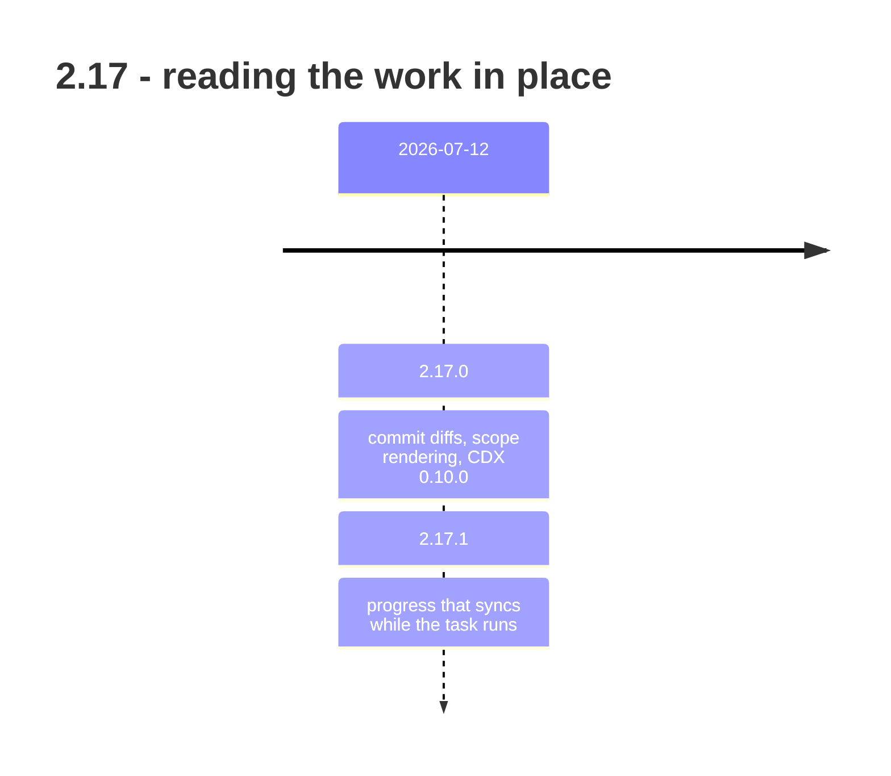

## road_003_2_17_reading_the_work_in_place - 2.17: reading the work in place

> Date: 2026-08-09
> Status: Settled
> Related product: (none yet)
> Related request: `req_291_preview_commit_diffs_from_git_history`, `req_292_improve_scope_section_rendering_in_document_previews`, `req_293_sync_backlog_progress_during_task_development_and_codify_task_checkpoints`
> Reminder: Update status, milestone scope, linked refs, risks, and success signals when you edit this doc.

# AI Context

- Summary: Retrospective roadmap for 2.17 — commit diffs, scope rendering, and CDX 0.10.0 inside the viewer, plus backlog progress that updates while a task is being worked.
- Keywords: roadmap, retrospective, 2.17, git history, diff preview, backlog progress, checkpoints, CDX
- Use when: You need to know when the viewer stopped requiring a second window.
- Skip when: You need execution details for a single backlog item or task.

# Summary

Two releases, one idea: stop making the operator leave the board. Commit diffs became
previewable from git history, scope sections started rendering properly in document
previews, and CDX 0.10.0 was integrated into the viewer.

The quieter item is the more important one. `req_293_sync_backlog_progress_during_task_development_and_codify_task_checkpoints` made backlog progress sync *during*
task development and codified task checkpoints — before it, progress was a number written
at the end, which meant it was a claim rather than a measurement.

# Milestones

## 2.17.0 - commit diffs and CDX 0.10.0 in the viewer

- Delivered: Commit diffs preview from git history (`req_291_preview_commit_diffs_from_git_history`, `task_288_orchestrate_git_history_commit_diff_previews`). Scope sections
  render correctly in document previews (`req_292_improve_scope_section_rendering_in_document_previews`, `task_289_orchestrate_scope_section_preview_rendering`). CDX 0.10.0 integrated in
  the viewer, with VS Code viewer updates alongside it.
- Proven by: v2.17.0, released 2026-07-12.

## 2.17.1 - progress that syncs while the task runs

- Delivered: Backlog progress syncs during task development, and task checkpoints were
  codified as guidance the runtime can hold work to (`req_293_sync_backlog_progress_during_task_development_and_codify_task_checkpoints`, `task_290_orchestrate_live_backlog_progress_and_checkpointed_task_guidance`). Viewer and
  VS Code fixes.
- Proven by: v2.17.1, released 2026-07-12.
- Why it matters: This is the earliest ancestor of the thread that dominates 2.19.6 through
  2.21 — progress reported from what happened, not from what was intended.

# Sequencing

Both releases on the same day; 2.17.1 carried the request-backed work and 2.17.0 the viewer
features that were already finished.

# What this line did not settle

- Checkpoints were codified as guidance, not enforced as a gate. The gate arrives in 2.21.0
  with `req_316_make_the_closeout_gate_teachable_self_consistent_and_non_destructive`, four minor versions later, after the guidance turned out to be
  ignorable.

# Success signals

- A commit's diff can be read from the board without switching to a terminal.
- A backlog item's progress reflects work already done, not work planned.

# References

- Product brief(s): (none yet)
- Request(s): `req_291_preview_commit_diffs_from_git_history`, `req_292_improve_scope_section_rendering_in_document_previews`, `req_293_sync_backlog_progress_during_task_development_and_codify_task_checkpoints`
- Backlog item(s): (none yet)
- Task(s): `task_288_orchestrate_git_history_commit_diff_previews`, `task_289_orchestrate_scope_section_preview_rendering`, `task_290_orchestrate_live_backlog_progress_and_checkpointed_task_guidance`
- Releases: v2.17.0, v2.17.1 (both 2026-07-12)
