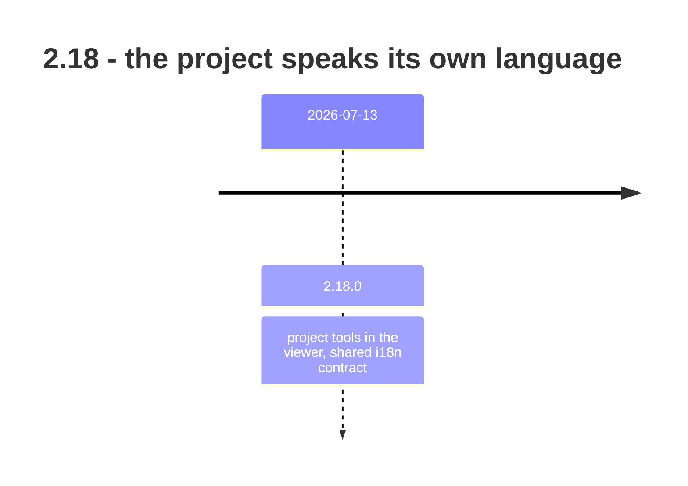

## road_004_2_18_the_project_speaks_its_own_language - 2.18: the project speaks its own language

> Date: 2026-08-09
> Status: Settled
> Related product: (none yet)
> Related request: `req_294_convention_aware_project_i18n_and_theme_viewer_screens`, `req_295_optional_project_owned_i18n_contract_and_lifecycle_tooling`
> Reminder: Update status, milestone scope, linked refs, risks, and success signals when you edit this doc.

# AI Context

- Summary: Retrospective roadmap for 2.18 — a single release adding project tools to the viewer and an optional, project-owned i18n contract.
- Keywords: roadmap, retrospective, 2.18, i18n, theme, project tools, conventions
- Use when: You need to know what the i18n contract is and why it is optional.
- Skip when: You need execution details for a single backlog item or task.

# Summary

The smallest line in the range, and the first time the runtime read a convention the
*project* owns rather than one the tool imposes. `req_294_convention_aware_project_i18n_and_theme_viewer_screens` gave the viewer
convention-aware i18n and theme screens; `req_295_optional_project_owned_i18n_contract_and_lifecycle_tooling` made the contract itself optional and
project-owned, with lifecycle tooling around it.

Optional is the whole design. A project that has no i18n contract is not a project with a
missing file — it is a project the feature does not apply to.

# Milestones

## 2.18.0 - project tools and a shared i18n contract

- Delivered: Project tools surfaced in the viewer. Convention-aware i18n and theme screens
  (`req_294_convention_aware_project_i18n_and_theme_viewer_screens`, `task_291_orchestrate_convention_aware_i18n_and_theme_viewer_delivery`). An optional, project-owned i18n contract with lifecycle tooling
  (`req_295_optional_project_owned_i18n_contract_and_lifecycle_tooling`, `task_292_orchestrate_optional_i18n_contract_and_lifecycle_delivery`).
- Proven by: v2.18.0, released 2026-07-13.

# Sequencing

Single release. `req_294_convention_aware_project_i18n_and_theme_viewer_screens` discovered the conventions, `req_295_optional_project_owned_i18n_contract_and_lifecycle_tooling` gave them a contract, and
both shipped together rather than the discovery landing first.

# What this line did not settle

- `logics/i18n/` holds one document. The contract exists and is exercised by roughly one
  project — this one.
- Convention-aware means convention-guessing until a project declares a contract, and
  nothing prompts a project to declare one.

# Success signals

- A project's own i18n conventions drive the viewer screens, with no configuration for
  projects that have none.

# References

- Product brief(s): (none yet)
- Request(s): `req_294_convention_aware_project_i18n_and_theme_viewer_screens`, `req_295_optional_project_owned_i18n_contract_and_lifecycle_tooling`
- Backlog item(s): (none yet)
- Task(s): `task_291_orchestrate_convention_aware_i18n_and_theme_viewer_delivery`, `task_292_orchestrate_optional_i18n_contract_and_lifecycle_delivery`
- Releases: v2.18.0 (2026-07-13)
