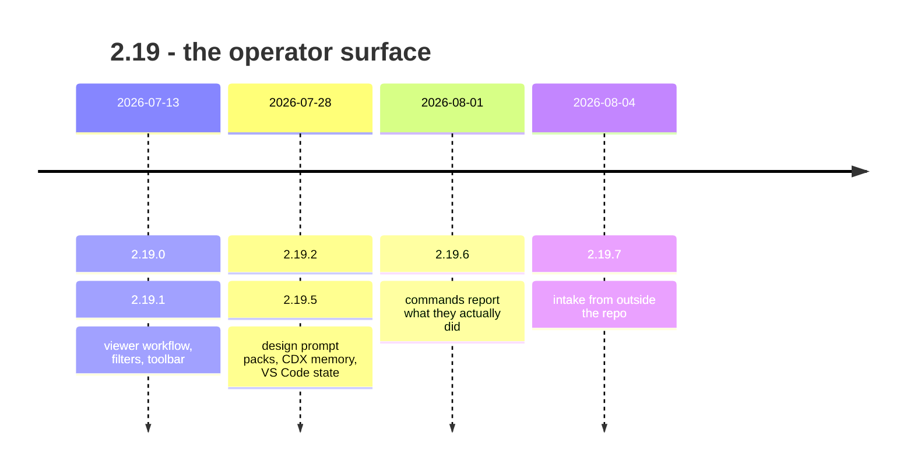

## road_005_2_19_the_operator_surface - 2.19: the operator surface

> Date: 2026-08-09
> Status: Settled
> Related product: (none yet)
> Related request: `req_296_add_first_class_roadmap_planning_to_logics_manager`, `req_297_improve_logics_operator_ergonomics_for_evidence_memory_packaging_and_roadmap_flow`, `req_298_add_a_cdx_memory_viewer_screen_for_cleaned_handoff_inspection`, `req_299_add_logics_design_asset_prompt_packs_for_ai_generated_artwork_workflows`, `req_300_agent_facing_correctness_of_generated_docs_and_cli_contracts`, `req_301_create_a_multi_channel_request_intake_and_github_issues_bridge`, `req_302_github_issue_9_preserve_viewer_project_favorites_across_vs_code_workspace_changes`
> Reminder: Update status, milestone scope, linked refs, risks, and success signals when you edit this doc.

# AI Context

- Summary: Retrospective roadmap for the 2.19 line — eight releases between 2026-07-13 and 2026-08-04 that made the tool usable by an operator who is not its author.
- Keywords: roadmap, retrospective, 2.19, viewer, prompt packs, honest reporting, intake
- Use when: You need to know what the 2.19 line delivered and which requests carried it.
- Skip when: You need execution details for a single backlog item or task.

# Summary

2.19 was written from the outside in. Every milestone starts at a surface an operator
actually touches — the board, the prompts, the command output, the issue tracker — and
works backwards into the runtime. It is also the line where `roadmap` became a
first-class document kind (`req_296_add_first_class_roadmap_planning_to_logics_manager`), which is why this file can exist at all.

# Milestones

## 2.19.1 - viewer workflow, filters, and toolbar

- Delivered: Workflow actions moved into the viewer, filters stopped disagreeing with the
  board they filtered, and the toolbar became legible at real window sizes.
- Carried by: `req_297_improve_logics_operator_ergonomics_for_evidence_memory_packaging_and_roadmap_flow` (operator ergonomics), `task_294_orchestrate_logics_operator_ergonomics_improvements`.
- Proven by: v2.19.0 and v2.19.1, released 2026-07-13.

## 2.19.5 - design prompt packs and CDX memory inspection

- Delivered: Logics Design prompt packs for AI-generated artwork (`req_299_add_logics_design_asset_prompt_packs_for_ai_generated_artwork_workflows`), a CDX Memory
  screen for inspecting cleaned handoffs (`req_298_add_a_cdx_memory_viewer_screen_for_cleaned_handoff_inspection`), the sheet grid, and viewer state that
  survives a VS Code reload.
- Carried by: `req_298_add_a_cdx_memory_viewer_screen_for_cleaned_handoff_inspection`, `req_299_add_logics_design_asset_prompt_packs_for_ai_generated_artwork_workflows`, `task_295_orchestrate_cdx_memory_viewer_screen_delivery`, `task_296_orchestrate_logics_design_asset_prompt_pack_delivery`.
- Proven by: v2.19.2 through v2.19.5, released 2026-07-28 to 2026-07-29.
- Note: 2.19.3 exists because the first prompt pack generated output that did not match its
  own spec. The fix was to hold the generator to a written output contract, not to reword
  the prompt.

## 2.19.6 - commands that report what they actually did

- Delivered: The turn where the tool stopped flattering itself. Commands report the work
  they performed rather than the work they attempted; scaffolded tasks no longer assert
  progress that has not happened; closeout accepts precise validation evidence; indicator
  updates became kind-aware and exit honestly.
- Carried by: `req_300_agent_facing_correctness_of_generated_docs_and_cli_contracts` (agent-facing correctness of generated docs and CLI contracts),
  `task_297_orchestrate_agent_facing_correctness_remediation`.
- Proven by: v2.19.6, released 2026-08-01.
- Why it matters: This is the first milestone of the thread that runs through 2.20 and 2.21.
  A memory layer that overstates itself is worse than no memory layer.

## 2.19.7 - intake from outside the repo

- Delivered: GitHub Issues became a guarded Logics intake channel, and viewer project
  shortcuts stopped being lost when the VS Code workspace changed (GitHub issue 9 — the
  first external report to reach a release).
- Carried by: `req_301_create_a_multi_channel_request_intake_and_github_issues_bridge`, `req_302_github_issue_9_preserve_viewer_project_favorites_across_vs_code_workspace_changes`.
- Proven by: v2.19.7, released 2026-08-04.

# Sequencing

Delivered in ascending version order. The line was not planned as a whole: 2.19.0 through
2.19.5 answered operator friction as it was found, and 2.19.6 was the consequence of
looking at what those commands had been claiming.

# What this line did not settle

- `roadmap` shipped as a document kind in 2.19 (`req_296_add_first_class_roadmap_planning_to_logics_manager`) and then went unused until this
  file, three minor versions later. Shipping a surface is not the same as adopting it.
- Eight patch releases in twenty-two days is a symptom, not a cadence. 2.19.3 and 2.19.4
  both corrected work released days earlier.

# Success signals

- The viewer is the primary surface for workflow actions, not a read-only board.
- Command output can be trusted by an agent without reading the transcript that produced it.
- An external issue can enter the corpus without hand-copying it.

# References

- Product brief(s): (none yet)
- Request(s): `req_296_add_first_class_roadmap_planning_to_logics_manager`, `req_297_improve_logics_operator_ergonomics_for_evidence_memory_packaging_and_roadmap_flow`, `req_298_add_a_cdx_memory_viewer_screen_for_cleaned_handoff_inspection`, `req_299_add_logics_design_asset_prompt_packs_for_ai_generated_artwork_workflows`, `req_300_agent_facing_correctness_of_generated_docs_and_cli_contracts`, `req_301_create_a_multi_channel_request_intake_and_github_issues_bridge`, `req_302_github_issue_9_preserve_viewer_project_favorites_across_vs_code_workspace_changes`
- Backlog item(s): (none yet)
- Task(s): `task_293_deliver_first_class_roadmap_planning_support`, `task_294_orchestrate_logics_operator_ergonomics_improvements`, `task_295_orchestrate_cdx_memory_viewer_screen_delivery`, `task_296_orchestrate_logics_design_asset_prompt_pack_delivery`, `task_297_orchestrate_agent_facing_correctness_remediation`
- Releases: v2.19.0 … v2.19.7 (2026-07-13 → 2026-08-04)
