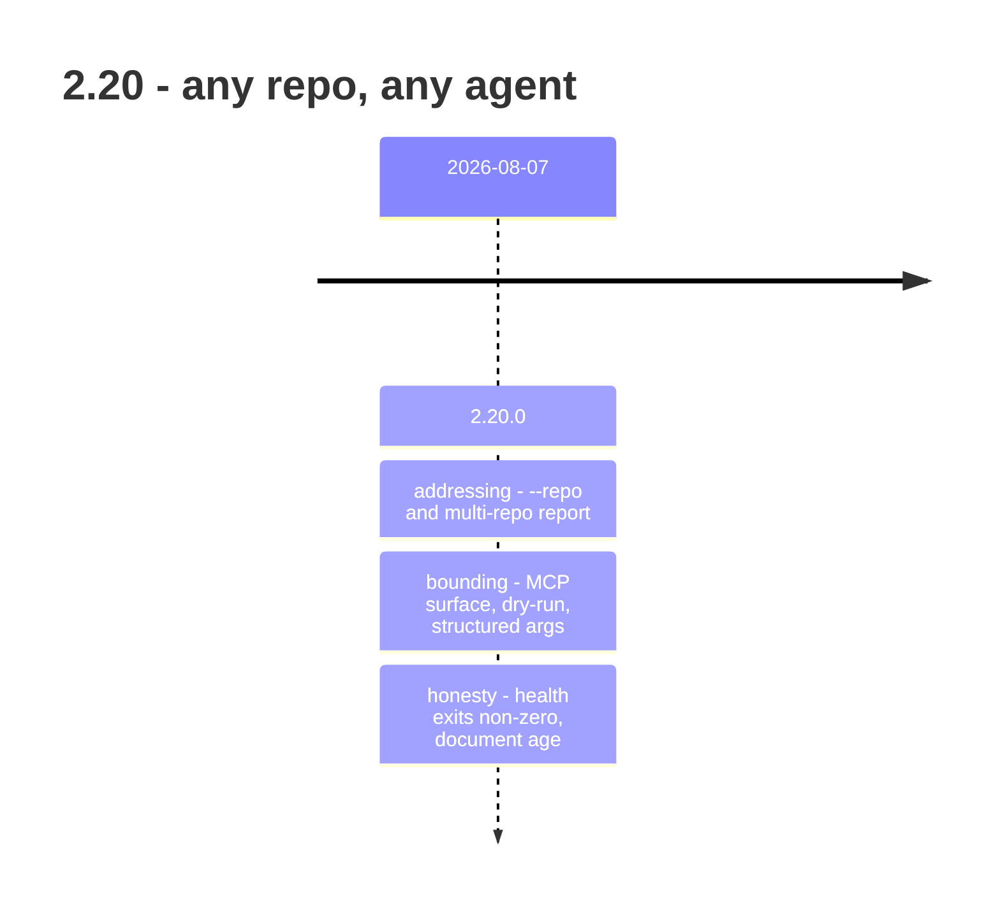

## road_006_2_20_any_repo_any_agent - 2.20: any repo, any agent

> Date: 2026-08-09
> Status: Settled
> Related product: (none yet)
> Related request: `req_303_make_logics_manager_embeddable_by_external_orchestrators_across_multiple_repositories`, `req_304_make_the_documented_per_command_help_contract_work_across_the_whole_cli_surface`, `req_305_give_the_viewer_surfaces_the_same_workflow_signals_the_cli_reports`, `req_306_act_on_the_repository_review_measurement_honesty_guardrails_and_the_viewer_module_split`, `req_307_close_the_gaps_the_second_review_found_stated_risk_cache_concurrency_and_untested_route_branches`
> Reminder: Update status, milestone scope, linked refs, risks, and success signals when you edit this doc.

# AI Context

- Summary: Retrospective roadmap for 2.20 — the single release that removed the assumption that the runtime runs inside the repository it manages.
- Keywords: roadmap, retrospective, 2.20, multi-repo, embedding, MCP, dry-run, skills
- Use when: You need to know what 2.20 changed about where and how the runtime can be called.
- Skip when: You need execution details for a single backlog item or task.

# Summary

One release, one assumption removed. Until 2.20, every command answered for the current
working directory and the tool was something you ran *in* a project. After 2.20 it is
something an orchestrator calls *about* projects — any number of them, from anywhere, with
a bounded surface and a preview before it writes.

This is the only single-patch line in the 2.19–2.21 range, and the only one where the
scope was decided before the work started rather than discovered during it.

# Milestones

## 2.20.0 - the runtime leaves its own repository

Delivered in four groups:

**Addressing.** `--repo` targets any repository from anywhere, and a report can span every
repository under a root. Carried by `req_303_make_logics_manager_embeddable_by_external_orchestrators_across_multiple_repositories` (embeddable by external orchestrators across
multiple repositories) and `task_300_orchestrate_the_multi_repository_and_embedder_contract_delivery`.

**Bounding.** The MCP tool surface can be restricted, any mutation can be previewed before
it runs, and tool arguments pass structurally instead of through shell quoting. Carried by
`req_303_make_logics_manager_embeddable_by_external_orchestrators_across_multiple_repositories` and `req_304_make_the_documented_per_command_help_contract_work_across_the_whole_cli_surface` (the per-command help contract, restored across the whole CLI
surface, `task_301_restore_the_per_command_help_contract_across_the_cli_surface`).

**Honesty.** `logics-manager health` now exits non-zero when it reports a problem — a
breaking change for pipelines that ran it for side effects. Document age and stale work
became reportable. The viewer reads the same workflow health report the CLI does. Carried
by `req_305_give_the_viewer_surfaces_the_same_workflow_signals_the_cli_reports` (viewer parity with CLI signals, `task_302_orchestrate_viewer_parity_with_the_cli_workflow_signals`) and `req_306_act_on_the_repository_review_measurement_honesty_guardrails_and_the_viewer_module_split` (measurement
honesty guardrails, `task_303_orchestrate_the_repository_review_remediation`).

**Aftermath.** `req_307_close_the_gaps_the_second_review_found_stated_risk_cache_concurrency_and_untested_route_branches` closed what a second review found — stated risk, cache
concurrency, and untested route branches — before the release was cut (`task_304_orchestrate_the_second_review_remediation`).

- Proven by: v2.20.0, released 2026-08-07.
- Also shipped: self-update now acts on the copy that is running, and four bundled agent
  skills.

# Sequencing

Single milestone. The two review passes (`req_306_act_on_the_repository_review_measurement_honesty_guardrails_and_the_viewer_module_split`, then `req_307_close_the_gaps_the_second_review_found_stated_risk_cache_concurrency_and_untested_route_branches` on what the first pass
missed) ran inside it rather than after it, which is why 2.20 needed no patch release and
2.19 needed seven.

# What this line did not settle

- Reach was widened before anyone was reaching. Multi-repo addressing and a bounded MCP
  surface were built for orchestrators that, at the time of writing, are mostly this
  project's own agents.
- `health` changing its exit code is a breaking change shipped in a minor version.
- Self-update acting on the running copy fixed the wrong half of the problem: it does not
  help when a second, older executable shadows the one that updated itself. That surfaced
  again in 2.21.1 and was still not fixed there.

# Success signals

- An external orchestrator can drive the runtime against a repository it does not live in.
- A mutation can be inspected before it is written.
- The exit status of every command agrees with the verdict in its payload.

# References

- Product brief(s): (none yet)
- Request(s): `req_303_make_logics_manager_embeddable_by_external_orchestrators_across_multiple_repositories`, `req_304_make_the_documented_per_command_help_contract_work_across_the_whole_cli_surface`, `req_305_give_the_viewer_surfaces_the_same_workflow_signals_the_cli_reports`, `req_306_act_on_the_repository_review_measurement_honesty_guardrails_and_the_viewer_module_split`, `req_307_close_the_gaps_the_second_review_found_stated_risk_cache_concurrency_and_untested_route_branches`
- Backlog item(s): (none yet)
- Task(s): `task_300_orchestrate_the_multi_repository_and_embedder_contract_delivery`, `task_301_restore_the_per_command_help_contract_across_the_cli_surface`, `task_302_orchestrate_viewer_parity_with_the_cli_workflow_signals`, `task_303_orchestrate_the_repository_review_remediation`, `task_304_orchestrate_the_second_review_remediation`
- Releases: v2.20.0 (2026-08-07)
