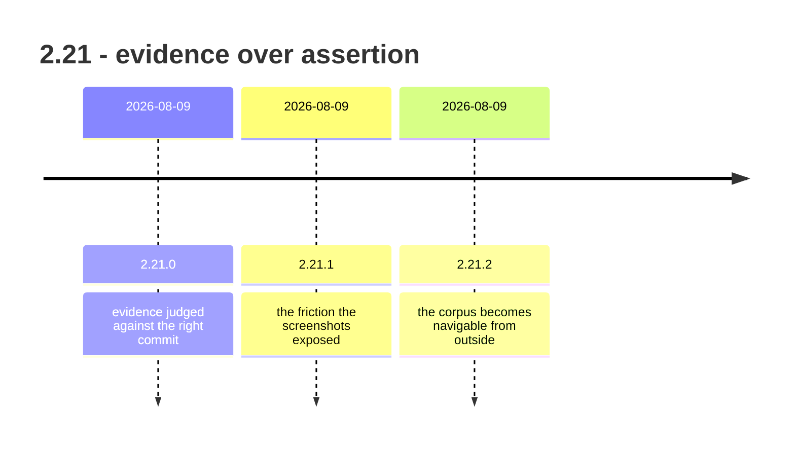

## road_007_2_21_evidence_over_assertion - 2.21: evidence over assertion

> Date: 2026-08-09
> Status: Settled
> Related product: (none yet)
> Related request: `req_308_report_workflow_outcomes_honestly_across_audit_help_and_closeout`, `req_309_turn_the_viewer_visual_smoke_into_a_ui_campaign_that_reports_what_it_measured`, `req_310_make_the_board_filters_answer_with_what_the_board_actually_shows`, `req_311_lift_the_viewer_s_sub_systems_out_of_its_core_and_turn_the_size_ledger_into_a_ratchet`, `req_312_finish_lifting_the_browser_host_s_sub_systems_on_the_seam_cdx_proved`, `req_313_write_down_the_architecture_the_viewer_already_has_a_named_store_server_driven_invalidation_declared_screens`, `req_314_close_what_the_attended_tour_found_say_what_is_unavailable_count_what_is_shown_report_when_a_screen_is_done`, `req_315_persist_viewer_preferences_where_they_belong_favourites_for_the_user_the_rest_for_the_repository`, `req_316_make_the_closeout_gate_teachable_self_consistent_and_non_destructive`, `req_317_judge_release_evidence_against_the_commit_the_release_was_cut_from`, `req_318_cover_the_remaining_logics_lifecycle_in_bundled_skills_and_package_as_a_claude_code_plugin`, `req_319_standardize_the_obsidian_projection_into_a_graph_navigable_visualization_surface`, `req_320_render_a_bounded_chain_graph_view_in_the_browser_viewer`, `req_321_move_ai_context_ahead_of_the_truncation_boundary_with_a_repair_path_for_existing_docs`, `req_322_one_viewer_per_repo_and_a_resolved_port_story_across_the_viewer_and_mcp`, `req_323_review_findings_security_tests_structure_dependencies`
> Reminder: Update status, milestone scope, linked refs, risks, and success signals when you edit this doc.

# AI Context

- Summary: Retrospective roadmap for the 2.21 line — three releases in nine days that made the tool prove its claims instead of asserting them, and made the corpus readable from outside the tool.
- Keywords: roadmap, retrospective, 2.21, release evidence, closeout gate, viewer architecture, skills, Obsidian, chain graph
- Use when: You need to know what the 2.21 line delivered and which requests carried it.
- Skip when: You need execution details for a single backlog item or task.

# Summary

Sixteen requests in nine days, and almost all of them are the same request wearing
different clothes: *say the true thing*. Release evidence had been judged against whatever
commit happened to be checked out. Board filters answered about a dataset the board was not
showing. The viewer named a screen you were not on. The closeout gate asked for something
it would then reject. Each was a component confidently reporting a state it had not
verified.

The line ends somewhere else entirely: 2.21.2 stops improving how the tool talks to its
operator and starts letting the corpus be read without the tool at all.

# Milestones

## 2.21.0 - evidence judged against the right commit

- Delivered: Release gates carry a `comparison` — `release` gates are judged against the
  commit the tag was cut from, `branch` gates against current `HEAD` — so a published
  release stays green while work continues (`req_317_judge_release_evidence_against_the_commit_the_release_was_cut_from`, `task_314_orchestrate_judging_evidence_against_the_release`). Board filters answer
  with what the board actually shows (`req_310_make_the_board_filters_answer_with_what_the_board_actually_shows`, `task_307_orchestrate_the_board_filter_corrections`). Viewer preferences split
  between the operator and the repository (`req_315_persist_viewer_preferences_where_they_belong_favourites_for_the_user_the_rest_for_the_repository`, `task_312_orchestrate_moving_the_viewer_preferences_off_the_port`). The viewer says what just
  happened and what will not (`req_314_close_what_the_attended_tour_found_say_what_is_unavailable_count_what_is_shown_report_when_a_screen_is_done`, `task_311_orchestrate_the_attended_tour_findings`). The closeout gate became teachable,
  self-consistent, and non-destructive (`req_316_make_the_closeout_gate_teachable_self_consistent_and_non_destructive`, `task_313_orchestrate_making_the_closeout_gate_satisfiable`).
- Also: honest outcomes across audit, help, and closeout (`req_308_report_workflow_outcomes_honestly_across_audit_help_and_closeout`, `task_305_orchestrate_the_honest_outcome_corrections`); the visual
  smoke became a UI campaign that reports what it measured (`req_309_turn_the_viewer_visual_smoke_into_a_ui_campaign_that_reports_what_it_measured`, `task_306_orchestrate_the_viewer_ui_campaign`); the
  viewer's sub-systems were lifted out of its core against a size ratchet (`req_311_lift_the_viewer_s_sub_systems_out_of_its_core_and_turn_the_size_ledger_into_a_ratchet`,
  `req_312_finish_lifting_the_browser_host_s_sub_systems_on_the_seam_cdx_proved`, `task_308_orchestrate_lifting_the_sub_systems_out_of_the_core`, `task_309_orchestrate_finishing_the_browser_host_split`); and the architecture the viewer already had was
  finally written down (`req_313_write_down_the_architecture_the_viewer_already_has_a_named_store_server_driven_invalidation_declared_screens`, `task_310_orchestrate_naming_the_viewer_architecture`).
- Proven by: v2.21.0, released 2026-08-09.

## 2.21.1 - the friction the screenshots exposed

- Delivered: No requests — every item came from putting screenshots in the README and
  looking at them. `flow repair ac-traceability` stopped crashing on its own skipped notes;
  the viewer stopped misreporting the current screen; a two-word title stopped wrapping one
  letter per line; the duplicate-executable warning became dismissible for the session.
- Proven by: v2.21.1, released 2026-08-09.
- Why it is here: The cheapest defect-finding pass of the whole range was screenshotting
  the product for documentation. That is a process finding, not a feature.

## 2.21.2 - the corpus becomes navigable from outside

- Delivered: Bundled skills now cover the full Logics lifecycle and install as a Claude Code
  plugin (`req_318_cover_the_remaining_logics_lifecycle_in_bundled_skills_and_package_as_a_claude_code_plugin`, `task_315_orchestrate_skill_coverage_expansion_and_claude_code_plugin_packaging`). The Obsidian projection generates real wikilinks instead of
  isolated nodes (`req_319_standardize_the_obsidian_projection_into_a_graph_navigable_visualization_surface`, `task_316_orchestrate_the_obsidian_graph_navigable_projection`). A bounded chain-graph view landed in the browser
  viewer (`req_320_render_a_bounded_chain_graph_view_in_the_browser_viewer`, `task_317_orchestrate_the_bounded_chain_graph_view`). AI Context moved ahead of the truncation boundary, with a
  repair path for existing docs (`req_321_move_ai_context_ahead_of_the_truncation_boundary_with_a_repair_path_for_existing_docs`, `task_318_orchestrate_moving_ai_context_ahead_of_the_truncation_boundary`). One viewer per repo, with a resolved
  port story across viewer and MCP (`req_322_one_viewer_per_repo_and_a_resolved_port_story_across_the_viewer_and_mcp`, `task_319_orchestrate_coordinated_viewer_mcp_server_lifecycle`). Five fixes from a whole-repo
  review (`req_323_review_findings_security_tests_structure_dependencies`, `task_320_orchestrate_the_review_findings_cleanup`).
- Proven by: v2.21.2, released 2026-08-09.
- Why it matters: `req_321_move_ai_context_ahead_of_the_truncation_boundary_with_a_repair_path_for_existing_docs` is the sharpest item in the line. AI Context was being written
  past the point where an agent's context window truncates the document — the memory layer
  was placing its own summary where the reader would never reach it.

# Sequencing

Three releases on the same day. 2.21.0 was planned, 2.21.1 was reactive, 2.21.2 was a second
planned batch. The ordering was not a design; it was what fit between two pushes.

# What this line did not settle

- Three releases in one day is not a cadence anyone can follow, including its author.
- The duplicate-executable warning was made dismissible rather than fixed. The actual cause
  is two global npm installs under different prefixes; the real repair is uninstalling the
  stale one, which the tool could detect and offer but does not.
- `req_311_lift_the_viewer_s_sub_systems_out_of_its_core_and_turn_the_size_ledger_into_a_ratchet`/`req_312_finish_lifting_the_browser_host_s_sub_systems_on_the_seam_cdx_proved` split the viewer's sub-systems out of its core, and `viewer.py` is
  still the largest module in the repository.
- Sixteen requests in nine days were all authored by the same person who implemented them.
  Nothing in the range was validated by an operator who did not already know the answer.

# Success signals

- A published release stays green while the branch moves on.
- Every viewer surface reports the state it is actually rendering.
- The corpus can be read in Obsidian, in the board, or as plain Markdown, without the CLI.

# References

- Product brief(s): (none yet)
- Request(s): `req_308_report_workflow_outcomes_honestly_across_audit_help_and_closeout`, `req_309_turn_the_viewer_visual_smoke_into_a_ui_campaign_that_reports_what_it_measured`, `req_310_make_the_board_filters_answer_with_what_the_board_actually_shows`, `req_311_lift_the_viewer_s_sub_systems_out_of_its_core_and_turn_the_size_ledger_into_a_ratchet`, `req_312_finish_lifting_the_browser_host_s_sub_systems_on_the_seam_cdx_proved`, `req_313_write_down_the_architecture_the_viewer_already_has_a_named_store_server_driven_invalidation_declared_screens`, `req_314_close_what_the_attended_tour_found_say_what_is_unavailable_count_what_is_shown_report_when_a_screen_is_done`, `req_315_persist_viewer_preferences_where_they_belong_favourites_for_the_user_the_rest_for_the_repository`, `req_316_make_the_closeout_gate_teachable_self_consistent_and_non_destructive`, `req_317_judge_release_evidence_against_the_commit_the_release_was_cut_from`, `req_318_cover_the_remaining_logics_lifecycle_in_bundled_skills_and_package_as_a_claude_code_plugin`, `req_319_standardize_the_obsidian_projection_into_a_graph_navigable_visualization_surface`, `req_320_render_a_bounded_chain_graph_view_in_the_browser_viewer`, `req_321_move_ai_context_ahead_of_the_truncation_boundary_with_a_repair_path_for_existing_docs`, `req_322_one_viewer_per_repo_and_a_resolved_port_story_across_the_viewer_and_mcp`, `req_323_review_findings_security_tests_structure_dependencies`
- Backlog item(s): (none yet)
- Task(s): `task_305_orchestrate_the_honest_outcome_corrections`, `task_306_orchestrate_the_viewer_ui_campaign`, `task_307_orchestrate_the_board_filter_corrections`, `task_308_orchestrate_lifting_the_sub_systems_out_of_the_core`, `task_309_orchestrate_finishing_the_browser_host_split`, `task_310_orchestrate_naming_the_viewer_architecture`, `task_311_orchestrate_the_attended_tour_findings`, `task_312_orchestrate_moving_the_viewer_preferences_off_the_port`, `task_313_orchestrate_making_the_closeout_gate_satisfiable`, `task_314_orchestrate_judging_evidence_against_the_release`, `task_315_orchestrate_skill_coverage_expansion_and_claude_code_plugin_packaging`, `task_316_orchestrate_the_obsidian_graph_navigable_projection`, `task_317_orchestrate_the_bounded_chain_graph_view`, `task_318_orchestrate_moving_ai_context_ahead_of_the_truncation_boundary`, `task_319_orchestrate_coordinated_viewer_mcp_server_lifecycle`, `task_320_orchestrate_the_review_findings_cleanup`
- Releases: v2.21.0, v2.21.1, v2.21.2 (all 2026-08-09)
