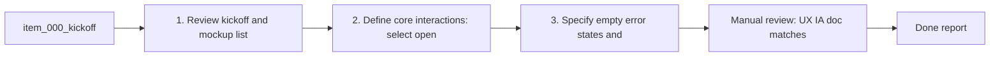

## task_000_define_ux_and_ia_for_logics_orchestrator - Define UX and IA for Logics Orchestrator
> From version: 1.9.1 (refreshed)
> Status: Done
> Understanding: 91% (audit-aligned)
> Confidence: 86% (governed)
> Progress: 100%

# Context
Derived from `logics/backlog/item_000_kickoff.md`.
Define the information architecture, layout, and interaction model for the Logics Orchestrator
inside VS Code (board + details panel + commands), aligned with the kickoff and mockup.

# Plan
- [x] 1. Review kickoff and mockup; list primary views and navigation (board, details).
- [x] 2. Define core interactions: select, open, refresh, promote (if enabled).
- [x] 3. Specify empty/error states and minimal onboarding.
- [x] FINAL: Update backlog notes with UX/IA decisions.

# Validation
- Manual review: UX/IA doc matches kickoff acceptance criteria.

# Definition of Done (DoD)
- [x] Scope implemented and acceptance direction covered.
- [x] Validation executed at the level expected for this task.
- [x] Linked request/backlog/task docs updated where relevant.
- [x] Status is `Done` and progress is `100%`.

# Report
UX/IA defined as a VS Code activity bar view with a flow board (Requests/Backlog/Tasks/Specs) and a right-side details panel. Core actions: select card, open file, refresh index, and optional promote from request/backlog. Empty state messaging and error handling added to the UI plan and backlog notes.

# Notes
