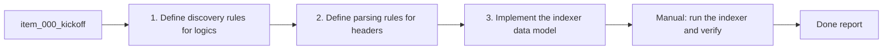

## task_001_implement_logics_indexer_and_data_model - Implement Logics indexer and data model
> From version: 1.9.1 (refreshed)
> Status: Done
> Understanding: 86% (audit-aligned)
> Confidence: 81% (governed)
> Progress: 100%

# Context
Derived from `logics/backlog/item_000_kickoff.md`.
Define how the extension discovers Logics files and extracts metadata (id, title, stage,
status, path, updated time) to power the board and details panel.

# Plan
- [x] 1. Define discovery rules for `logics/request|backlog|tasks|specs/*.md`.
- [x] 2. Define parsing rules for headers/indicators and fallback defaults.
- [x] 3. Implement the indexer + data model (and sample output for UI wiring).
- [x] FINAL: Document parsing assumptions in the backlog item.

# Validation
- Manual: run the indexer and verify it lists the correct files and stages.

# Definition of Done (DoD)
- [x] Scope implemented and acceptance direction covered.
- [x] Validation executed at the level expected for this task.
- [x] Linked request/backlog/task docs updated where relevant.
- [x] Status is `Done` and progress is `100%`.

# Report
Implemented a file-system indexer that scans `logics/*` folders, parses titles and indicators from Markdown, and returns a normalized data model for the UI. Added stage-based promotion rules (request/backlog only).

# Notes
