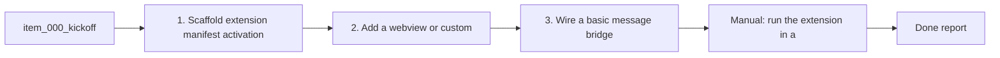

## task_002_scaffold_vs_code_extension_and_view_containers - Scaffold VS Code extension and view containers
> From version: 1.9.1 (refreshed)
> Status: Done
> Understanding: 86% (audit-aligned)
> Confidence: 81% (governed)
> Progress: 100%

# Context
Derived from `logics/backlog/item_000_kickoff.md`.
Create the VS Code extension skeleton, commands, and view containers needed to host
the Logics Orchestrator UI.

# Plan
- [x] 1. Scaffold extension (manifest, activation, commands, view container).
- [x] 2. Add a webview (or custom view) for the board + details panel.
- [x] 3. Wire a basic message bridge between extension and UI.
- [x] FINAL: Note required dev setup in the backlog.

# Validation
- Manual: run the extension in a dev host and confirm the view appears.

# Definition of Done (DoD)
- [x] Scope implemented and acceptance direction covered.
- [x] Validation executed at the level expected for this task.
- [x] Linked request/backlog/task docs updated where relevant.
- [x] Status is `Done` and progress is `100%`.

# Report
Scaffolded a VS Code extension with activity bar view container, commands, and a webview view. Added HTML/CSS/JS assets and a message bridge for refresh/open/promote actions.

# Notes
