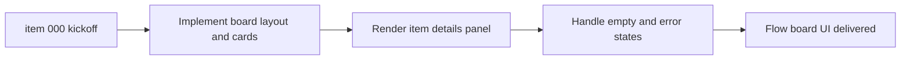

## task_003_build_flow_board_ui_and_details_panel - Build Flow Board UI and details panel
> From version: 1.9.1
> Status: Done
> Understanding: 85% (audit-aligned)
> Confidence: 80% (governed)
> Progress: 100%

# Context
Derived from `logics/backlog/item_000_kickoff.md`.
Implement the Logics flow board UI (columns + cards) and a details panel
in the VS Code view.

# Plan
- [x] 1. Build the board layout and render columns/cards from indexer data.
- [x] 2. Implement selection state and the details panel content.
- [x] 3. Add empty/error states and basic styling.
- [x] FINAL: Capture UI decisions in the backlog notes.

# Validation
- Manual: verify UI renders, selection updates, and empty states display.

# Definition of Done (DoD)
- [x] Scope implemented and acceptance direction covered.
- [x] Validation executed at the level expected for this task.
- [x] Linked request/backlog/task docs updated where relevant.
- [x] Status is `Done` and progress is `100%`.

# Report
Built the flow board UI with stage columns, selectable cards, and a details panel. Added empty/error states and VS Code-themed styling in the webview assets.

# Notes
