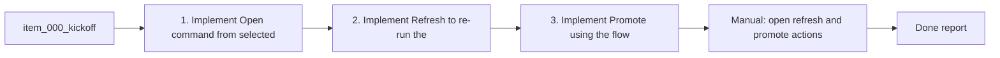

## task_004_wire_actions_open_refresh_promote - Wire actions: open, refresh, promote
> From version: 1.9.1 (refreshed)
> Status: Done
> Understanding: 86% (audit-aligned)
> Confidence: 81% (governed)
> Progress: 100%

# Context
Derived from `logics/backlog/item_000_kickoff.md`.
Connect UI actions to VS Code commands: open file, refresh/reindex, and (optional)
promote via the Logics flow script.

# Plan
- [x] 1. Implement "Open" command from selected card.
- [x] 2. Implement "Refresh" to re-run the indexer and update the UI.
- [x] 3. Implement "Promote" using the flow manager script with error handling.
- [x] FINAL: Confirm non-destructive behavior in documentation.

# Validation
- Manual: open, refresh, and promote actions work; errors are surfaced in the UI.

# Definition of Done (DoD)
- [x] Scope implemented and acceptance direction covered.
- [x] Validation executed at the level expected for this task.
- [x] Linked request/backlog/task docs updated where relevant.
- [x] Status is `Done` and progress is `100%`.

# Report
Wired open/refresh/promote actions from the webview to extension commands. Promote uses the existing flow manager script for request/backlog items and surfaces errors in VS Code.

# Notes
