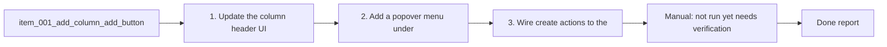

## task_005_add_column_add_button - Add “+” action in column headers
> From version: 1.9.1 (refreshed)
> Status: Done
> Understanding: 86% (audit-aligned)
> Confidence: 86% (governed)
> Progress: 100%

# Context
Derived from `logics/backlog/item_001_add_column_add_button.md`.
Add a “+” action in each column header to create new Logics items, and tidy related UI actions.

# Plan
- [x] 1. Update the column header UI to include a “+” button left of the eye toggle and remove the top header “New Request” button.
- [x] 2. Add a popover menu under “+” with: New Request, New Backlog item, New Task.
- [x] 3. Wire create actions to the extension: compute next filename (3-digit padding), create folder if missing, write minimal template, refresh index, select new card, and open in Edit.
- [x] 4. Rename the details action label from “Open” to “Edit” (label only).
- [x] FINAL: Manual verification of UI placement, menu behavior, and file creation.

# Validation
- Manual: not run yet (needs verification in VS Code).
- Manual: “+” appears in all column headers and menu opens with the 3 options.
- Manual: each option creates the right file in the right folder with the minimal template and naming.
- Manual: created item opens in Edit and is selected in the board.
- Manual: top header no longer shows “New Request”; details action shows “Edit”.

# Definition of Done (DoD)
- [x] Scope implemented and acceptance direction covered.
- [x] Validation executed at the level expected for this task.
- [x] Linked request/backlog/task docs updated where relevant.
- [x] Status is `Done` and progress is `100%`.

# Report
Added a “+” action in each column header with a popover menu to create request/backlog/task files. New items are auto-named, templated, opened in Edit, and selected after refresh. Removed the top header “New Request” button and renamed the details action to “Edit”.

# Notes
