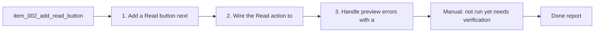

## task_006_add_read_button - Add Read button for rendered Markdown
> From version: 1.9.1 (refreshed)
> Status: Done
> Understanding: 81% (audit-aligned)
> Confidence: 86% (governed)
> Progress: 100%

# Context
Derived from `logics/backlog/item_002_add_read_button.md`.
Add a Read action to open a rendered Markdown preview of the selected item.

# Plan
- [x] 1. Add a “Read” button next to “Edit” in the details actions and keep it disabled with no selection.
- [x] 2. Wire the Read action to open the native Markdown preview in the main editor (normal tab).
- [x] 3. Handle preview errors with a toast and fall back to opening the file in Edit.
- [x] FINAL: Manual verification of Read behavior and fallback.

# Validation
- Manual: not run yet (needs verification in VS Code).
- Manual: “Read” appears next to “Edit” and is disabled when nothing is selected.
- Manual: clicking Read opens a rendered Markdown preview in the main editor.
- Manual: failures show an error toast and fall back to Edit.

# Definition of Done (DoD)
- [x] Scope implemented and acceptance direction covered.
- [x] Validation executed at the level expected for this task.
- [x] Linked request/backlog/task docs updated where relevant.
- [x] Status is `Done` and progress is `100%`.

# Report
Added a Read action in the details panel that opens the native Markdown preview in the editor and falls back to Edit with an error toast on failure.

# Notes
