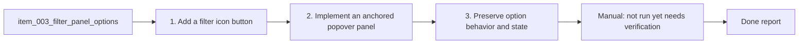

## task_007_filter_panel_options - Regroup options into filter panel
> From version: 1.9.1 (refreshed)
> Status: Done
> Understanding: 91% (audit-aligned)
> Confidence: 91% (governed)
> Progress: 100%

# Context
Derived from `logics/backlog/item_003_filter_panel_options.md`.
Move toolbar options into a filter popover opened via a filter icon.

# Plan
- [x] 1. Add a filter icon button to the toolbar row, positioned to the left of the action buttons.
- [x] 2. Implement an anchored popover panel under the icon containing the existing toggles.
- [x] 3. Preserve option behavior and state persistence; add active-state styling on the icon when any option is enabled.
- [x] 4. Close the popover on outside click or Esc.
- [x] FINAL: Manual verification of layout, behavior, and accessibility.

# Validation
- Manual: not run yet (needs verification in VS Code).
- Manual: filter icon appears to the left of the action buttons on the toolbar row.
- Manual: clicking the icon opens/closes the options popover; outside click and Esc close it.
- Manual: toggles work as before and remain persisted across refresh.
- Manual: filter icon reflects active state when any option is enabled.

# Definition of Done (DoD)
- [x] Scope implemented and acceptance direction covered.
- [x] Validation executed at the level expected for this task.
- [x] Linked request/backlog/task docs updated where relevant.
- [x] Status is `Done` and progress is `100%`.

# Report
Moved toolbar toggles into an anchored filter popover opened by a filter icon button, with active-state styling and outside/Esc dismissal.

# Notes
