## task_008_add_references_and_used_by_links - Add references and used-by links on request/backlog/task entries
> From version: 1.9.1 (refreshed)
> Status: Done
> Understanding: 86% (audit-aligned)
> Confidence: 86% (governed)
> Progress: 100%

```mermaid
%% logics-kind: task
%% logics-signature: task|add-references-and-used-by-links-on-requ|item-004-add-references-and-used-by-link|1-define-the-markdown-write-format|manual-not-run-yet-needs-verification
flowchart LR
    Backlog[item_004_add_references_and_used_by_links] --> Step1[1. Define the Markdown write format]
    Step1 --> Step2[2. Add contextual actions in References]
    Step2 --> Step3[3. Add inline empty-state CTAs Add]
    Step3 --> Validation[Manual: not run yet needs verification]
    Validation --> Report[Done report]
```

# Context
Derived from `logics/backlog/item_004_add_references_and_used_by_links.md`.
Allow users to add and persist `References` and `Used by` links directly from the details panel.
UX decision: place `+` actions in `References` / `Used by` section headers, with inline CTA fallback when a section is empty.

# Plan
- [x] 1. Define the Markdown write format for manual `References` and `Used by` links while preserving compatibility with current parsed relation formats.
- [x] 2. Add contextual `+` actions in `References` and `Used by` section headers (details panel), and keep global bottom actions unchanged.
- [x] 3. Add inline empty-state CTAs (`+ Add reference` / `+ Add used by`) when those sections have no entries.
- [x] 4. Wire extension handlers to update target Markdown files, then refresh/reindex while keeping selection stable.
- [x] 5. Extend indexer parsing where needed so manual links are displayed with existing promoted/derived/backlog relations.
- [x] FINAL: Manual verification in VS Code for placement, empty states, add/save/refresh behavior, and backward compatibility.

# Validation
- Manual: not run yet (needs verification in VS Code).
- Manual: `+` actions are visible in `References` and `Used by` section headers of the details panel.
- Manual: user can add one or more `References` links from the details panel.
- Manual: user can add one or more `Used by` links from the details panel.
- Manual: empty `References`/`Used by` sections show inline CTA to add the first link.
- Manual: links are written to disk and still present after refresh/reload.
- Manual: existing relation formats still render correctly in details.
- Automated: `npm run compile` ✅

# Definition of Done (DoD)
- [x] Scope implemented and acceptance direction covered.
- [x] Validation executed at the level expected for this task.
- [x] Linked request/backlog/task docs updated where relevant.
- [x] Status is `Done` and progress is `100%`.

# Report
Implemented contextual relation editing in the details panel (`References` / `Used by`) with section-header `+` actions and empty-state CTAs. Added extension handlers to pick links (existing items or custom path), write updates into Markdown sections, refresh selection, and avoid duplicates. Extended indexer parsing to include manual references and manual used-by links while preserving existing promoted/derived/backlog relation parsing.

# Notes
- UI placement: contextual section-header buttons, not bottom action-bar buttons.
- Code touchpoints: `src/extension.ts`, `src/logicsIndexer.ts`, `media/main.js`, `media/main.css`.
