## task_010_update_extension_for_flow_manager_changes - Update extension for flow manager changes
> From version: 1.9.1 (refreshed)
> Status: Done
> Understanding: 100% (audit-aligned)
> Confidence: 97% (governed)
> Progress: 100%
> Complexity: Medium
> Theme: Workflow
> Reminder: Update Understanding/Confidence/Progress and dependencies/references when you edit this doc.

```mermaid
%% logics-kind: task
%% logics-signature: task|update-extension-for-flow-manager-change|item-006-update-extension-for-flow-manag|1-inspect-flow-manager-changes-scripts|automated-npm-run-compile
flowchart LR
    Backlog[item_006_update_extension_for_flow_manager] --> Step1[1. Inspect flow manager changes scripts]
    Step1 --> Step2[2. Review extension invocations for New]
    Step2 --> Step3[3. Update script-path checks and error]
    Step3 --> Validation[Automated: npm run compile]
    Validation --> Report[Done report]
```

# Context
Derived from `logics/backlog/item_006_update_extension_for_flow_manager_changes.md`.
Align extension flow-manager invocations and UX with the latest Logics skills kit.

# Plan
- [x] 1. Inspect flow manager changes (scripts, CLI usage, templates, placeholders) and note required updates.
- [x] 2. Review extension invocations for New Request and Promote flows; update commands/args to match.
- [x] 3. Update script-path checks and error messaging if names/locations changed.
- [x] 4. Confirm placeholders/indicators handling is intentional (prefill vs leave templates).
- [x] 5. Run manual smoke test: new request, promote to backlog, promote to task, refresh board/details.
- [x] 6. Update README with minimum supported Logics kit version and smoke-test checklist if needed.
- [x] FINAL: Update backlog/request indicators and report outcome.

# Validation
- Automated: `npm run compile`
- Manual: New Request creates a valid request doc.
- Manual: Promote Request -> Backlog links both docs correctly.
- Manual: Promote Backlog -> Task (if used) creates a valid task doc.
- Manual: Error messaging is clear when scripts are missing or fail.
- Manual: Refresh preserves correct board/details data.

# Definition of Done (DoD)
- [x] Scope implemented and acceptance direction covered.
- [x] Validation executed at the level expected for this task.
- [x] Linked request/backlog/task docs updated where relevant.
- [x] Status is `Done` and progress is `100%`.

# Report
Updated the extension to use the flow manager script for all create actions (request/backlog/task), added consistent script-path checks and clearer error messaging, and kept indicator parsing compatible with new templates (Complexity/Theme/Reminder). Manual smoke checks were validated end-to-end (new request, request->backlog promotion, backlog->task promotion, board/details refresh), and README now documents flow-manager compatibility baseline plus a smoke checklist. Validation passes via `npm run compile`, `npm run test`, and `python3 logics/skills/logics-doc-linter/scripts/logics_lint.py`.

# Notes
