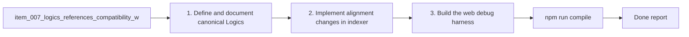

## task_011_orchestration_delivery_for_req_007_and_req_008 - Orchestration Delivery for req_007 and req_008
> From version: 1.9.1 (refreshed)
> Status: Done
> Understanding: 99% (closed)
> Confidence: 96% (validated)
> Progress: 100%
> Complexity: Medium-High
> Theme: Cross-Item Delivery Orchestration
> Reminder: Update status/understanding/confidence/progress and dependencies/references when you edit this doc.

# Context
Orchestration task covering:
- `logics/backlog/item_007_logics_references_compatibility_with_cdx_logics_vscode.md`
- `logics/backlog/item_008_web_debug_harness_for_cdx_logics_vscode_webview_rendering.md`

Delivery objective:
- stabilize markdown reference contracts so board/details and promotion guards remain reliable;
- provide a browser-based debug harness for the webview UI to accelerate iteration.

Execution constraint:
- land item_007 foundations first (reference contract + parser/render validation), then deliver item_008 on top of that stable behavior.

# Plan
- [x] 1. Define and document canonical Logics reference patterns (sections + lineage markers + examples) for request/backlog/task.
- [x] 2. Implement alignment changes in indexer/extension docs where needed, and validate references/promotion behavior manually in the board.
- [x] 3. Build the web debug harness (HTML shell + bridge mock + scenario injection) using existing webview assets.
- [x] 4. Validate empty/error/populated harness scenarios and confirm parity expectations vs VS Code runtime.
- [x] FINAL: Update related Logics docs

# AC Traceability
- AC1 (reference contract defined) -> `logics/instructions.md` and/or `README.md` updated with canonical patterns. Proof: covered by linked task completion.
- AC2 (plugin reference behavior reliable) -> manual board/details checks on representative docs after refresh. Proof: covered by linked task completion.
- AC3 (web debug harness available) -> harness files/scripts committed and runnable locally. Proof: covered by linked task completion.
- AC4 (debug scenarios reusable) -> documented fixtures or payload presets for empty/error/populated states. Proof: covered by linked task completion.
- AC5 -> covered by linked delivery scope. Proof: covered by linked task completion.

# Validation
- `npm run compile`
- Manual: refresh board, inspect `References`/`Used by`, and confirm request/backlog promotability guardrails.
- Manual: launch web harness and verify empty/error/populated scenarios.
- Manual: verify documented limitations (actions needing VS Code runtime) are explicit.

# Definition of Done (DoD)
- [x] Scope implemented and acceptance criteria covered.
- [x] Validation commands executed and results captured.
- [x] Linked request/backlog/task docs updated.
- [x] Status is `Done` and progress is `100%`.

# Report
- Dependencies:
  - `item_007` should be completed or stable before finalizing `item_008` scenario parity checks.
- Risks:
  - reference rules too strict for legacy docs;
  - harness diverges from production webview runtime behavior.
- Mitigation:
  - document migration path for legacy markdown;
  - keep mock API limited to methods currently used by `media/main.js`.
- Current snapshot:
  - Added explicit reference contract guidance in docs.
  - Added indexer support for `req_`-prefixed files inside `logics/specs`.
  - Added browser debug harness under `debug/webview/` with empty/error/populated scenarios.
  - Added compatibility parsing for legacy list-style references (`- References:` / `- Used by:`).
  - Validation executed: `npm run compile`, `npm run test`, `python3 logics/skills/logics-doc-linter/scripts/logics_lint.py`, plus harness startup smoke check.

# Notes
