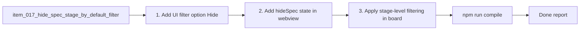

## task_018_orchestration_delivery_for_req_017_hide_spec_filter_default - Orchestration delivery for req_017 Hide SPEC filter default
> From version: 1.6.0 (refreshed)
> Status: Done
> Understanding: 100% (refreshed)
> Confidence: 99%
> Progress: 100%
> Complexity: Medium
> Theme: Filter behavior delivery orchestration
> Reminder: Update status/understanding/confidence/progress and dependencies/references when you edit this doc.

# Context
Derived from:
- `logics/backlog/item_017_hide_spec_stage_by_default_filter_option.md`

Goal:
- deliver a complete filter behavior for SPEC visibility with hidden-by-default UX across board and list modes, without regressions.

# Plan
- [x] 1. Add UI filter option (`Hide SPEC`) in extension webview and harness markup.
- [x] 2. Add `hideSpec` state in webview runtime with default `true`.
- [x] 3. Apply stage-level filtering in board/list rendering and in item visibility checks.
- [x] 4. Persist/restore `hideSpec` alongside existing filter state.
- [x] 5. Extend tests for default hidden SPEC and toggle behavior across board/list.
- [x] 6. Validate compile/test/doc lint.
- [x] FINAL: Update related Logics docs

# AC Traceability
- AC1/AC2 -> Steps 1-2. Proof: covered by linked task completion.
- AC3/AC4/AC5 -> Step 3. Proof: covered by linked task completion.
- AC6 -> Step 4. Proof: covered by linked task completion.
- Regression coverage -> Step 5.

# Validation
- `npm run compile`
- `npm run test`
- `python3 logics/skills/logics-doc-linter/scripts/logics_lint.py`

# Definition of Done (DoD)
- [x] Scope implemented and acceptance criteria covered.
- [x] Validation commands executed and results captured.
- [x] Linked request/backlog/task docs updated.
- [x] Status is `Done` and progress is `100%`.

# Report
- Implemented:
  - `src/extension.ts` and `debug/webview/index.html`: added `hide-spec` filter checkbox.
  - `media/main.js`: introduced persisted `hideSpec` state (default `true`), applied SPEC filtering in `isVisible()`, stage rendering guards via `getVisibleStages()`, and active-filter state integration.
  - `tests/webview.harness-a11y.test.ts`: added coverage verifying SPEC is hidden by default and toggle works in board/list modes.
  - `tests/webview.layout-collapse.test.ts`: updated harness DOM bootstrap with `hide-spec` input.
- Validation executed:
  - `npm run compile`
  - `npm run test`
  - `python3 logics/skills/logics-doc-linter/scripts/logics_lint.py`

# Notes
