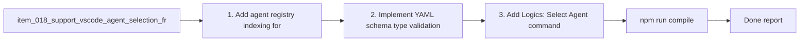

## task_019_orchestration_delivery_for_req_018_agent_selection_from_openai_yaml - Orchestration delivery for req_018 agent selection from openai.yaml
> From version: 1.6.1 (refreshed)
> Status: Done
> Understanding: 100% (refreshed)
> Confidence: 100%
> Progress: 100%
> Complexity: Medium
> Theme: Agent orchestration execution
> Reminder: Update status/understanding/confidence/progress and dependencies/references when you edit this doc.

# Context
Derived from:
- `logics/backlog/item_018_support_vscode_agent_selection_from_skills_openai_yaml.md`

Goal:
- deliver agent discovery + selection UX wired to Codex chat prefill, while preserving explicit `$logics-...` override semantics and adding robust YAML validation/refresh workflows.

# Plan
- [x] 1. Add agent registry indexing for `logics/skills/*/agents/openai.yaml`.
- [x] 2. Implement YAML schema/type validation + duplicate computed-ID detection.
- [x] 3. Add `Logics: Select Agent` command with Quick Pick (`display_name`, `short_description`, `detail` as `$logics-...`).
- [x] 4. Implement active-agent state handling and persistence.
- [x] 5. Integrate Codex chat prefill (`default_prompt`) with non-destructive merge behavior.
- [x] 6. Implement explicit invocation guard/override rules for `$logics-...`.
- [x] 7. Add `Logics: Refresh Agents` command and output-channel reporting.
- [x] 8. Add/adjust tests for registry parsing, validation, and command behavior.
- [x] 9. Run compile/test/logics lint validations.
- [x] FINAL: Update related Logics docs

# AC Traceability
- AC1 -> Step 1. Proof: covered by linked task completion.
- AC2/AC3 -> Step 3. Proof: covered by linked task completion.
- AC4 -> Step 4. Proof: covered by linked task completion.
- AC5/AC6 -> Step 5. Proof: covered by linked task completion.
- AC7 -> Step 6. Proof: covered by linked task completion.
- AC8 -> Step 2. Proof: covered by linked task completion.
- AC9/AC10 -> Step 7. Proof: covered by linked task completion.
- Regression safety -> Step 8.

# Validation
- `npm run compile`
- `npm run test`
- `python3 logics/skills/logics-doc-linter/scripts/logics_lint.py`

# Definition of Done (DoD)
- [x] Scope implemented and acceptance criteria covered.
- [x] Validation commands executed and results captured.
- [x] Linked request/backlog/task docs updated.
- [x] Status is `Done` and progress is `100%`.

# Report
- Implemented:
  - Added `src/agentRegistry.ts` to scan and validate `logics/skills/*/agents/openai.yaml` (`interface.display_name`, `short_description`, `default_prompt`) and derive invocation IDs (`$logics-...`) from skill folders.
  - Added duplicate invocation detection and structured validation issue reporting.
  - Wired agent state into `src/extension.ts` with persisted active agent and command handlers.
  - Added `Logics: Select Agent` Quick Pick + `Logics: Refresh Agents` command.
  - Added `Logics Agents` output channel for validation refresh reports.
  - Implemented Codex-first chat handoff: `chatgpt.openSidebar` opens Codex and the selected `default_prompt` is copied to clipboard for immediate paste in the Codex composer (`chatgpt.newChat` shortcut offered).
  - Kept a fallback path to VS Code generic chat prefill when Codex commands are unavailable.
  - Added a `Select Agent` action in the Logics `Tools` menu (webview) to trigger agent selection without using the command palette.
  - Expanded file watcher coverage to include YAML/YML updates in `logics/`.
  - Updated extension command contributions in `package.json` and docs in `README.md`.
  - Added unit coverage in `tests/agentRegistry.test.ts`.
- Validation executed:
  - `npm run compile`
  - `npm run test`
  - `python3 logics/skills/logics-doc-linter/scripts/logics_lint.py`

# Notes
