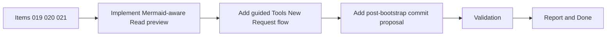

## task_020_orchestration_delivery_for_req_019_req_020_and_req_021 - Orchestration delivery for req_019 req_020 and req_021
> From version: 1.7.0
> Status: Ready
> Understanding: 96%
> Confidence: 94%
> Progress: 0%
> Complexity: High
> Theme: Cross-item delivery orchestration
> Reminder: Update status/understanding/confidence/progress and dependencies/references when you edit this doc.

# Context
Derived from:
- `logics/backlog/item_019_render_mermaid_diagrams_in_read_markdown_view.md`
- `logics/backlog/item_020_add_tools_new_request_action_for_codex_prompt_bootstrap.md`
- `logics/backlog/item_021_propose_commit_after_bootstrap_with_generated_message.md`

This task bundles three adjacent workflow improvements across the extension host, webview tools menu, and bootstrap/read experience:
- Mermaid rendering in the `Read` path for Logics docs;
- a guided `Tools > New Request` Codex entrypoint;
- a post-bootstrap commit proposal with generated commit message.

Constraint:
- preserve current direct create flows, bootstrap safety, and existing markdown rendering behavior while extending these workflows.

# Plan
- [ ] 1. Implement Mermaid-aware `Read` preview path and confirm fallback behavior in VS Code runtime and harness mode.
- [ ] 2. Add `Tools > New Request` action that activates the request-authoring agent and bootstraps a Codex drafting prompt without breaking current create-file flows.
- [ ] 3. Extend bootstrap completion flow to propose a commit with a generated message, while keeping git handling safe for dirty or empty states.
- [ ] 4. Add or adjust tests, harness checks, and manual smoke validation for all three workflows.
- [ ] 5. Update user-facing documentation, including the README, to reflect the new `Read`, `Tools`, and bootstrap behaviors.
- [ ] FINAL: Update related Logics docs

# AC Traceability
- AC1-req019 -> Step 1. Proof: TODO.
- AC2-req019 -> Step 1 and Step 4. Proof: TODO.
- AC1-req020 -> Step 2. Proof: TODO.
- AC2-req020 -> Step 2 and Step 5. Proof: TODO.
- AC1-req021 -> Step 3. Proof: TODO.
- AC2-req021 -> Step 3 and Step 5. Proof: TODO.
- Cross-regression safety -> Step 4.

# Links
- Backlog item(s):
  - `logics/backlog/item_019_render_mermaid_diagrams_in_read_markdown_view.md`
  - `logics/backlog/item_020_add_tools_new_request_action_for_codex_prompt_bootstrap.md`
  - `logics/backlog/item_021_propose_commit_after_bootstrap_with_generated_message.md`
- Request(s):
  - `logics/request/req_019_render_mermaid_diagrams_in_read_markdown_view.md`
  - `logics/request/req_020_add_tools_new_request_action_for_codex_prompt_bootstrap.md`
  - `logics/request/req_021_propose_commit_after_bootstrap_with_generated_message.md`

# Validation
- `npm run compile`
- `npm run lint`
- `npm run test`
- `python3 logics/skills/logics-doc-linter/scripts/logics_lint.py`
- Manual: validate `Read` on Mermaid-bearing docs in VS Code and harness mode.
- Manual: validate `Tools > New Request` agent/prompt bootstrap behavior.
- Manual: validate bootstrap success path, commit proposal UX, and safe no-commit edge cases.

# Definition of Done (DoD)
- [ ] Scope implemented and acceptance criteria covered.
- [ ] Validation commands executed and results captured.
- [ ] README updated to describe the new behaviors.
- [ ] Linked request/backlog/task docs updated.
- [ ] Status is `Done` and progress is `100%`.

# Report
- Pending execution.
