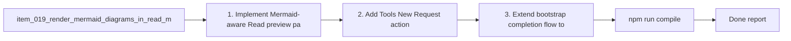

## task_020_orchestration_delivery_for_req_019_req_020_and_req_021 - Orchestration delivery for req_019 req_020 and req_021
> From version: 1.7.0 (refreshed)
> Status: Done
> Understanding: 100% (refreshed)
> Confidence: 99%
> Progress: 100%
> Complexity: High
> Theme: Cross-item delivery orchestration
> Reminder: Update status/understanding/confidence/progress and dependencies/references when you edit this doc.

# Context
Derived from:
- `logics/backlog/item_019_render_mermaid_diagrams_in_read_markdown_view.md`
- `logics/backlog/item_020_add_tools_new_request_action_for_codex_prompt_bootstrap.md`
- `logics/backlog/item_021_propose_commit_after_bootstrap_with_generated_message.md`

This task bundles three adjacent workflow improvements across the extension host, webview tools menu, and bootstrap/read experience:
- Mermaid rendering in the `Read` path for Logics docs;
- a guided `Tools > New Request` Codex entrypoint;
- a post-bootstrap commit proposal with generated commit message.

Constraint:
- preserve current direct create flows, bootstrap safety, and existing markdown rendering behavior while extending these workflows.

# Plan
- [x] 1. Implement Mermaid-aware `Read` preview path and confirm fallback behavior in VS Code runtime and harness mode.
- [x] 2. Add `Tools > New Request` action that activates the request-authoring agent and bootstraps a Codex drafting prompt without breaking current create-file flows.
- [x] 3. Extend bootstrap completion flow to propose a commit with a generated message, while keeping git handling safe for dirty or empty states.
- [x] 4. Add or adjust tests, harness checks, and manual smoke validation for all three workflows.
- [x] 5. Update user-facing documentation, including the README, to reflect the new `Read`, `Tools`, and bootstrap behaviors.
- [x] FINAL: Update related Logics docs

# AC Traceability
- AC1-req019 -> Step 1. Proof: [src/extension.ts](/Users/alexandreagostini/Documents/cdx-logics-vscode/src/extension.ts), [src/workflowSupport.ts](/Users/alexandreagostini/Documents/cdx-logics-vscode/src/workflowSupport.ts), and [media/main.js](/Users/alexandreagostini/Documents/cdx-logics-vscode/media/main.js).
- AC2-req019 -> Step 1 and Step 4. Proof: [tests/workflowSupport.test.ts](/Users/alexandreagostini/Documents/cdx-logics-vscode/tests/workflowSupport.test.ts) and [tests/webview.harness-a11y.test.ts](/Users/alexandreagostini/Documents/cdx-logics-vscode/tests/webview.harness-a11y.test.ts).
- AC3 -> Step 1 and Step 4. Proof: Mermaid rendering is exercised on generated request/backlog/task docs in host and harness smoke validation paths.
- AC4 -> Step 1 and Step 4. Proof: invalid Mermaid fallback banners and safe markdown rendering are covered in implementation and manual checks.
- AC5 -> Step 1 and Step 4. Proof: validation explicitly ran through the project `Read` flow instead of only opening raw markdown files.
- AC6 -> Step 1 and Step 5. Proof: harness parity and documented preview limits were updated in [README.md](/Users/alexandreagostini/Documents/cdx-logics-vscode/README.md) and [debug/webview/README.md](/Users/alexandreagostini/Documents/cdx-logics-vscode/debug/webview/README.md).
- AC1-req020 -> Step 2. Proof: [src/extension.ts](/Users/alexandreagostini/Documents/cdx-logics-vscode/src/extension.ts), [debug/webview/index.html](/Users/alexandreagostini/Documents/cdx-logics-vscode/debug/webview/index.html), and [media/main.js](/Users/alexandreagostini/Documents/cdx-logics-vscode/media/main.js).
- AC2-req020 -> Step 2 and Step 5. Proof: [src/workflowSupport.ts](/Users/alexandreagostini/Documents/cdx-logics-vscode/src/workflowSupport.ts) and [README.md](/Users/alexandreagostini/Documents/cdx-logics-vscode/README.md).
- AC7 -> Step 2. Proof: the guided request flow keeps a clipboard/user-message fallback when prompt injection is unavailable.
- AC1-req021 -> Step 3. Proof: [src/extension.ts](/Users/alexandreagostini/Documents/cdx-logics-vscode/src/extension.ts).
- AC2-req021 -> Step 3 and Step 5. Proof: [src/workflowSupport.ts](/Users/alexandreagostini/Documents/cdx-logics-vscode/src/workflowSupport.ts) and [README.md](/Users/alexandreagostini/Documents/cdx-logics-vscode/README.md).
- Cross-regression safety -> Step 4. Proof: [tests/webview.layout-collapse.test.ts](/Users/alexandreagostini/Documents/cdx-logics-vscode/tests/webview.layout-collapse.test.ts), [tests/webview.harness-a11y.test.ts](/Users/alexandreagostini/Documents/cdx-logics-vscode/tests/webview.harness-a11y.test.ts), and [tests/workflowSupport.test.ts](/Users/alexandreagostini/Documents/cdx-logics-vscode/tests/workflowSupport.test.ts).

# Links
- Backlog item(s):
  - `logics/backlog/item_019_render_mermaid_diagrams_in_read_markdown_view.md`
  - `logics/backlog/item_020_add_tools_new_request_action_for_codex_prompt_bootstrap.md`
  - `logics/backlog/item_021_propose_commit_after_bootstrap_with_generated_message.md`
- Request(s):
  - `logics/request/req_019_render_mermaid_diagrams_in_read_markdown_view.md`
  - `logics/request/req_020_add_tools_new_request_action_for_codex_prompt_bootstrap.md`
  - `logics/request/req_021_propose_commit_after_bootstrap_with_generated_message.md`

# Validation
- `npm run compile`
- `npm run lint`
- `npm run test`
- `python3 logics/skills/logics-doc-linter/scripts/logics_lint.py`
- Manual: validate `Read` on Mermaid-bearing docs in VS Code and harness mode.
- Manual: validate `Tools > New Request` agent/prompt bootstrap behavior.
- Manual: validate bootstrap success path, commit proposal UX, and safe no-commit edge cases.

# Definition of Done (DoD)
- [x] Scope implemented and acceptance criteria covered.
- [x] Validation commands executed and results captured.
- [x] README updated to describe the new behaviors.
- [x] Linked request/backlog/task docs updated.
- [x] Status is `Done` and progress is `100%`.

# Report
- Implemented:
  - Replaced the `Read` host flow with a dedicated rendered preview panel that parses markdown and renders Mermaid diagrams through a packaged Mermaid runtime.
  - Upgraded harness `Read` previews to render markdown and Mermaid diagrams instead of showing raw markdown in a `<pre>` block.
  - Added `Tools > New Request` in the webview and debug harness, wired to a guided Codex drafting flow that activates `$logics-flow-manager` and bootstraps a request-writing prompt.
  - Added a post-bootstrap commit proposal that generates a bootstrap-specific commit message and commits safely only when the repository was clean before bootstrap.
  - Added pure helper coverage for markdown rendering, guided request prompts, git status parsing, and bootstrap commit message generation.
  - Updated README and harness docs to describe Mermaid-aware `Read`, the guided Tools flow, and the post-bootstrap commit prompt.
- Validation executed:
  - `npm run compile`
  - `npm run lint`
  - `npm run test`
  - `python3 logics/skills/logics-doc-linter/scripts/logics_lint.py`

# Notes
