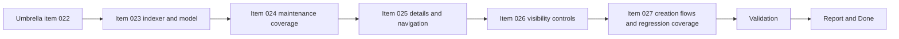

## task_021_align_vs_code_plugin_with_companion_docs_workflow - Align VS Code plugin with companion docs workflow
> From version: 1.8.1
> Status: In Progress
> Understanding: 98%
> Confidence: 95%
> Progress: 92%
> Complexity: High
> Theme: Companion docs workflow orchestration
> Reminder: Update status/understanding/confidence/progress and dependencies/references when you edit this doc.

# Context
- Derived from backlog item `item_022_align_vs_code_plugin_with_companion_docs_workflow`.
- Source file: `logics/backlog/item_022_align_vs_code_plugin_with_companion_docs_workflow.md`.
- Related request(s): `req_022_align_vs_code_plugin_with_companion_docs_workflow`.

This is an orchestration task, not a single-slice implementation task.
Its role is to deliver the request coherently across the five split backlog items:
- `item_023_align_plugin_indexer_and_managed_doc_model_for_companion_docs`
- `item_024_extend_plugin_rename_and_reference_maintenance_to_companion_docs`
- `item_025_add_companion_docs_section_and_navigation_in_plugin_details_panel`
- `item_026_add_supporting_doc_visibility_controls_to_plugin_board_and_list_views`
- `item_027_add_companion_doc_creation_flows_and_regression_coverage_in_plugin`

The task must stay aligned with:
- product direction in `prod_000_companion_docs_ux_for_the_vs_code_plugin`
- architectural direction in `adr_000_represent_companion_docs_in_the_vs_code_plugin_workflow_model`

Constraint:
- keep the plugin delivery-first;
- do not regress existing request/backlog/task flows;
- do not reintroduce hardcoded stage assumptions while adding companion-doc support.

# Plan
- [x] 1. Lock the execution order and implementation constraints from the product brief and ADR, then propagate them into child backlog items where needed.
- [x] 2. Deliver `item_023` and `item_024` first so managed-doc typing, indexing, and reference maintenance are stable before UI work starts.
- [x] 3. Deliver `item_025` and `item_026` on top of the new managed-doc model so the details panel, navigation flows, and visibility controls stay coherent.
- [x] 4. Deliver `item_027`, including explicit companion-doc creation flows and regression coverage across host logic, webview behavior, and managed-doc operations.
- [ ] 5. Run full validation across compile, lint, tests, and Logics checks, then update all linked request/backlog/task docs with the final traceability evidence.
- [ ] FINAL: Update related Logics docs

# AC Traceability
- AC1 -> Step 2 and Step 3. Proof: child items `023` to `026` completed with linked code and test evidence.
- AC2 -> Step 3. Proof: details panel and supporting-doc visibility behave according to the product brief.
- AC3 -> Step 3 and Step 4. Proof: companion-doc navigation and creation flows covered in UI and interaction tests.
- AC4 -> Step 2 and Step 4. Proof: rename/reference maintenance covers all managed-doc families.
- AC5 -> Step 4. Proof: explicit companion-doc creation path implemented and linked to regression tests.
- AC6 -> Step 3 and Step 4. Proof: filters, toggles, and labels behave consistently with the agreed control model.
- AC7 -> Step 5. Proof: existing request/backlog/task workflows still pass compile/lint/test and manual smoke checks.
- AC8 -> Step 5. Proof: indexer/webview/maintenance regressions covered in automated tests.
- AC9 -> Step 5. Proof: control-model behavior covered by tests for defaults, toggles, and actions.
- AC10 -> Step 2. Proof: stage and managed-doc assumptions centralized in implementation.
- AC11 -> Step 3. Proof: supporting-doc board visibility, if present, remains secondary and filterable.

# Decision framing
- Product framing: Required
- Product signals: pricing and packaging, navigation and discoverability
- Architecture framing: Required
- Architecture signals: data model and persistence, contracts and integration

# Links
- Product brief(s): `prod_000_companion_docs_ux_for_the_vs_code_plugin`
- Architecture decision(s): `adr_000_represent_companion_docs_in_the_vs_code_plugin_workflow_model`
- Backlog item: `item_022_align_vs_code_plugin_with_companion_docs_workflow`
- Request(s): `req_022_align_vs_code_plugin_with_companion_docs_workflow`

# Validation
- `npm run compile`
- `npm run lint`
- `npm run test`
- `python3 logics/skills/logics-doc-linter/scripts/logics_lint.py`
- Manual: validate companion-doc navigation from the details panel in both board and list modes.
- Manual: validate supporting-doc visibility controls and default hide/show behavior.
- Manual: validate companion-doc creation flow from the plugin without regressing existing request/backlog/task flows.

# Definition of Done (DoD)
- [x] Scope implemented and acceptance criteria covered for child items `023` to `027`; orchestration close-out still pending.
- [ ] Validation commands executed and results captured.
- [ ] Linked request/backlog/task docs updated.
- [ ] Status is `Done` and progress is `100%`.

# Report
- Current state:
  - managed-doc model and indexing aligned with `product` / `architecture`;
  - rename and reference maintenance aligned across managed doc families;
  - details panel now exposes companion docs, specs, and primary-flow backlinks with `Open` / `Read`;
  - supporting-doc visibility remains secondary and explicitly toggleable;
  - companion-doc creation is available from details, tools, and command palette;
  - automated coverage currently passes on compile and test.
