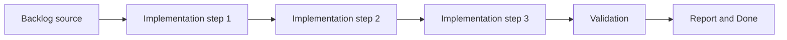

## task_022_replace_hide_used_requests_with_hide_processed_requests_semantics - Replace hide used requests with hide processed requests semantics
> From version: X.X.X
> Status: Ready
> Understanding: ??%
> Confidence: ??%
> Progress: 0%
> Complexity: Medium
> Theme: General
> Reminder: Update status/understanding/confidence/progress and dependencies/references when you edit this doc.

# Context
- Derived from backlog item `item_028_replace_hide_used_requests_with_hide_processed_requests_semantics`.
- Source file: `logics/backlog/item_028_replace_hide_used_requests_with_hide_processed_requests_semantics.md`.
- Related request(s): `req_023_replace_hide_used_requests_with_hide_processed_requests_semantics`.

# Plan
- [ ] 1. Clarify scope and acceptance criteria
- [ ] 2. Implement changes
- [ ] 3. Add/adjust tests and polish UX
- [ ] FINAL: Update related Logics docs

# AC Traceability
- AC1 -> Implemented in the steps above. Proof: add test/commit/file links.

# Decision framing
- Product framing: Consider
- Product signals: navigation and discoverability
- Architecture framing: Consider
- Architecture signals: data model and persistence

# Links
- Product brief(s): (none yet)
- Architecture decision(s): (none yet)
- Backlog item: `item_028_replace_hide_used_requests_with_hide_processed_requests_semantics`
- Request(s): `req_023_replace_hide_used_requests_with_hide_processed_requests_semantics`

# Validation
- npm run tests
- npm run lint

# Definition of Done (DoD)
- [ ] Scope implemented and acceptance criteria covered.
- [ ] Validation commands executed and results captured.
- [ ] Linked request/backlog/task docs updated.
- [ ] Status is `Done` and progress is `100%`.

# Report
