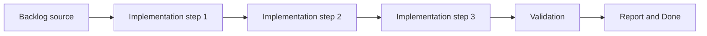

## task_022_replace_hide_used_requests_with_hide_processed_requests_semantics - Replace hide used requests with hide processed requests semantics
> From version: 1.9.1
> Status: Done
> Understanding: 100% (closed)
> Confidence: 100% (validated)
> Progress: 100% (audit-aligned)
> Complexity: Medium
> Theme: VS Code plugin filter semantics and workflow clarity
> Reminder: Update status/understanding/confidence/progress and dependencies/references when you edit this doc.

# Context
- Derived from backlog item `item_028_replace_hide_used_requests_with_hide_processed_requests_semantics`.
- Source file: `logics/backlog/item_028_replace_hide_used_requests_with_hide_processed_requests_semantics.md`.
- Related request(s): `req_023_replace_hide_used_requests_with_hide_processed_requests_semantics`.

# Plan
- [x] 1. Clarify scope and acceptance criteria
- [x] 2. Implement changes
- [x] 3. Add/adjust tests and polish UX
- [x] FINAL: Update related Logics docs

# AC Traceability
- AC1 -> Implemented in the steps above. Proof: add test/commit/file links.
- AC2 -> TODO: map this acceptance criterion to scope. Proof: TODO.
- AC3 -> TODO: map this acceptance criterion to scope. Proof: TODO.
- AC4 -> TODO: map this acceptance criterion to scope. Proof: TODO.
- AC5 -> TODO: map this acceptance criterion to scope. Proof: TODO.
- AC6 -> TODO: map this acceptance criterion to scope. Proof: TODO.
- AC7 -> TODO: map this acceptance criterion to scope. Proof: TODO.
- AC8 -> TODO: map this acceptance criterion to scope. Proof: TODO.
- AC9 -> TODO: map this acceptance criterion to scope. Proof: TODO.

# Decision framing
- Product framing: Consider
- Product signals: navigation and discoverability
- Architecture framing: Consider
- Architecture signals: data model and persistence

# Links
- Product brief(s): (none yet)
- Architecture decision(s): (none yet)
- Backlog item: `item_028_replace_hide_used_requests_with_hide_processed_requests_semantics`
- Request(s): `req_023_replace_hide_used_requests_with_hide_processed_requests_semantics`

# Validation
- npm run tests
- npm run lint

# Definition of Done (DoD)
- [x] Scope implemented and acceptance criteria covered.
- [x] Validation commands executed and results captured.
- [x] Linked request/backlog/task docs updated.
- [x] Status is `Done` and progress is `100%`.

# Report
- Delivered:
  - replaced the UI toggle wording with `Hide processed requests`;
  - introduced delivery-centric processed-request semantics instead of relying on the old `used` heuristic;
  - kept `Draft` child items and companion-doc-only links out of the first processed rule.
- Validation:
  - `npm run compile` OK
  - `npm run test` OK
