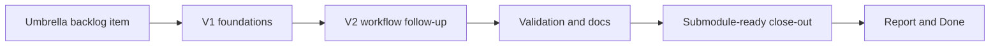

## task_024_harden_logics_kit_workflow_generation_and_governance_from_real_usage - Harden Logics kit workflow generation and governance from real usage
> From version: 1.9.1
> Status: Done
> Understanding: 99% (closed)
> Confidence: 98% (validated)
> Progress: 100% (audit-aligned)
> Complexity: High
> Theme: Shared Logics kit hardening orchestration
> Reminder: Update status/understanding/confidence/progress and dependencies/references when you edit this doc.

# Context
- Derived from backlog item `item_030_harden_logics_kit_workflow_generation_and_governance_from_real_usage`.
- Source file: `logics/backlog/item_030_harden_logics_kit_workflow_generation_and_governance_from_real_usage.md`.
- Related request(s): `req_025_harden_logics_kit_workflow_generation_and_governance_from_real_usage`.

This is an orchestration task for the shared Logics kit, not a repo-local feature task.
It must keep two constraints visible through the whole delivery:
- the kit is a shared submodule reused by multiple repositories;
- the resulting workflow must reduce repetitive manual cleanup for the agent itself, not only for downstream users.

# Plan
- [x] 1. Lock the phased execution model and shared-submodule constraints, then turn the broad request into an executable hardening sequence.
- [x] 2. Deliver V1 foundations first:
  - richer promotion output
  - explicit split workflow
  - robust id allocation
  - scoped audit
- [x] 3. Deliver V2 workflow follow-up without breaking generic behavior:
  - stronger AC traceability seeding
  - better finish/close propagation
  - more actionable decision framing
- [x] 4. Add or adjust tests, docs, and changelog/release notes across the shared kit.
- [x] FINAL: Update related Logics docs

# AC Traceability
- AC1 -> Step 1 and Step 4. Proof: execution framing and docs preserve shared-submodule constraints.
- AC2 -> Step 1. Proof: phased V1/V2 delivery captured before implementation starts.
- AC3 -> Step 1 and Step 4. Proof: this task stays orchestration-focused and links back to the umbrella backlog item.
- AC4 -> Step 2, Step 3, and Step 4. Proof: implementation and docs explicitly protect generic behavior and agent productivity goals.
- AC10 -> TODO: map this acceptance criterion to scope. Proof: TODO.
- AC11 -> TODO: map this acceptance criterion to scope. Proof: TODO.
- AC12 -> TODO: map this acceptance criterion to scope. Proof: TODO.
- AC5 -> TODO: map this acceptance criterion to scope. Proof: TODO.
- AC6 -> TODO: map this acceptance criterion to scope. Proof: TODO.
- AC7 -> TODO: map this acceptance criterion to scope. Proof: TODO.
- AC8 -> TODO: map this acceptance criterion to scope. Proof: TODO.
- AC9 -> TODO: map this acceptance criterion to scope. Proof: TODO.

# Decision framing
- Product framing: Not needed
- Product signals: (none detected)
- Architecture framing: Required
- Architecture signals: data model and persistence, contracts and integration

# Links
- Product brief(s): (none yet)
- Architecture decision(s): `adr_001_keep_logics_kit_hardening_incremental_generic_and_agent_productive`
- Backlog item: `item_030_harden_logics_kit_workflow_generation_and_governance_from_real_usage`
- Request(s): `req_025_harden_logics_kit_workflow_generation_and_governance_from_real_usage`

# Validation
- `python3 -m unittest discover -s tests -p 'test_*.py' -v`
- `python3 tests/run_cli_smoke_checks.py`
- `python3 logics-doc-linter/scripts/logics_lint.py`
- `python3 logics-flow-manager/scripts/workflow_audit.py`
- Manual: validate promotion output on a scratch repo.
- Manual: validate split behavior and id allocation under repeated creation.
- Manual: validate scoped audit usage on a bounded perimeter.

# Definition of Done (DoD)
- [x] Scope implemented and acceptance criteria covered.
- [x] Validation commands executed and results captured.
- [x] Linked request/backlog/task docs updated.
- [x] Status is `Done` and progress is `100%`.

# Report
- Current focus:
  - V1 should land first because it carries the strongest leverage for both downstream repos and the agent:
    - richer promotion
    - split support
    - robust ids
    - scoped audit
  - V2 should follow once the foundations are stable:
    - traceability seeding
    - finish/close synchronization
    - more actionable decision framing
- Shared-kit guardrails:
  - no repo-specific assumptions;
  - no overly free-form generated summaries by default;
  - conservative automation where user-authored report content could otherwise be overwritten.
- Current implementation status:
  - `logics_flow.py` now seeds richer backlog/task content from the source docs instead of leaving near-empty placeholders.
  - `logics_flow.py split request|backlog` now creates multiple child docs explicitly and keeps request/backlog links synchronized.
  - id allocation now uses atomic file reservation to avoid duplicate refs under repeated creation attempts.
  - `workflow_audit.py` now supports scoped execution via `--refs`, `--paths`, and `--since-version`.
  - seeded AC traceability now carries forward the acceptance-criterion summary instead of only a generic placeholder.
  - generated backlog/task docs now include explicit decision follow-up guidance in `# Decision framing`.
  - `finish task` now appends finish/report evidence to the task and leaves a completion note in linked backlog items.
  - tests and CLI smoke checks were extended to cover promotion seeding, split flows, and scoped audit usage.
- Remaining work:
  - no further implementation work is required for this iteration; future changes can build on `adr_001` if additional conservative synchronization is later justified.
