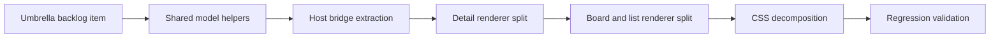

## task_026_refactor_webview_frontend_structure_without_introducing_a_full_framework - Refactor webview frontend structure without introducing a full framework
> From version: 1.9.0
> Status: Done
> Understanding: 99%
> Confidence: 98%
> Progress: 100%
> Complexity: High
> Theme: Webview frontend refactor orchestration
> Reminder: Update status/understanding/confidence/progress and dependencies/references when you edit this doc.

# Context
- Derived from backlog item `item_032_refactor_webview_frontend_structure_without_introducing_a_full_framework`.
- Source file: `logics/backlog/item_032_refactor_webview_frontend_structure_without_introducing_a_full_framework.md`.
- Related request(s): `req_026_refactor_webview_frontend_structure_without_introducing_a_full_framework`.

This is an orchestration task for the frontend-structure refactor of the webview.
It should improve maintainability without changing the plugin into a framework-heavy frontend or destabilizing current behavior.

# Plan
- [x] 1. Extract shared workflow/model helpers so stage logic and related document resolution stop being duplicated across rendering paths.
- [x] 2. Isolate the host communication layer behind clearer frontend bridge functions instead of mixed inline messaging calls.
- [x] 3. Split detail-panel and board/list rendering into clearer units while keeping `main.js` as a thin bootstrap entry point.
- [x] 4. Reorganize CSS by concern so layout, cards, detail panel, preview, and responsive rules are easier to maintain.
- [x] 5. Update tests and wiring so the refactor preserves current behavior and loading simplicity.
- [x] FINAL: Update related Logics docs

# AC Traceability
- AC1 -> Step 1, Step 2, and Step 3. Proof: webview logic is decomposed into explicit modules instead of staying concentrated in one file.
- AC2 -> Step 1. Proof: shared workflow/model helpers are extracted and reused.
- AC3 -> Step 2. Proof: host communication moves behind a bridge layer.
- AC4 -> Step 3. Proof: board/list and detail rendering are separated.
- AC5 -> Step 4. Proof: CSS structure is organized by UI concern.
- AC6 -> Step 3 and Step 4. Proof: bootstrap remains lightweight and no framework is introduced.
- AC7 -> Step 5. Proof: packaging, CSP compatibility, extension loading, and behavior remain stable.
- AC8 -> Step 5 and FINAL. Proof: automated tests remain green and docs are updated where boundaries change.
- AC9 -> FINAL. Proof: module boundaries remain pragmatic and understandable to future contributors.

# Decision framing
- Product framing: Not needed
- Product signals: (none detected)
- Architecture framing: Required
- Architecture signals: data model and persistence, contracts and integration, runtime and boundaries

# Links
- Product brief(s): (none yet)
- Architecture decision(s): `adr_002_keep_the_plugin_webview_as_a_modular_vanilla_frontend`
- Backlog item: `item_032_refactor_webview_frontend_structure_without_introducing_a_full_framework`
- Request(s): `req_026_refactor_webview_frontend_structure_without_introducing_a_full_framework`

# Validation
- `npm run compile`
- `npm run lint`
- `npm run test`
- Manual: validate webview load and core interactions after asset/module rewiring.
- Manual: validate markdown read mode and companion-doc interactions after renderer split.

# Definition of Done (DoD)
- [x] Scope implemented and acceptance criteria covered.
- [x] Validation commands executed and results captured.
- [x] Linked request/backlog/task docs updated.
- [x] Status is `Done` and progress is `100%`.

# Report
- Main focus:
  - improve maintainability and reviewability of the webview frontend;
  - preserve the current lightweight asset-loading model;
  - reduce future regression risk for detail-panel, board, and companion-doc changes.
- Refactor guardrails:
  - keep `main.js` as the bootstrap entry point;
  - do not introduce React, Vue, Svelte, or a comparable framework in this task;
  - prefer clear responsibility boundaries over splitting files mechanically without a model.
- Current implementation status:
  - stage/workflow helpers moved into `media/logicsModel.js`.
  - host bridge logic moved into `media/hostApi.js`.
  - board/list rendering now lives in `media/renderBoard.js`.
  - detail-panel rendering now lives in `media/renderDetails.js`.
  - markdown read-preview rendering now lives in `media/renderMarkdown.js`.
  - status UI, harness behavior, and split-layout control now also live in dedicated runtime modules.
  - `media/main.js` was reduced significantly and now acts much more like a bootstrap/state shell than a rendering monolith.
  - CSS is no longer only one monolith: `media/css/layout.css`, `media/css/toolbar.css`, `media/css/board.css`, and `media/css/details.css` now carry dedicated concerns behind `media/main.css`.
  - tests and smoke checks were rewired to load the modular assets and still pass, including packaged VSIX checks for the new assets.
- Close-out:
  - the accepted architectural direction is now recorded in `adr_002`.
  - related request/backlog/task docs were synchronized at close-out.
