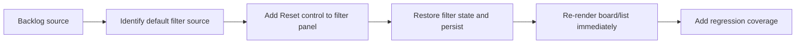

## task_027_add_reset_action_for_filter_defaults - Add reset action to restore default filter options
> From version: 1.9.3
> Status: Proposed
> Understanding: 98%
> Confidence: 97%
> Progress: 0%
> Complexity: Low
> Theme: Filter ergonomics and recoverability
> Reminder: Update status/understanding/confidence/progress and dependencies/references when you edit this doc.

# Context
- Derived from backlog item `item_034_add_reset_action_for_filter_defaults`.
- Source file: `logics/backlog/item_034_add_reset_action_for_filter_defaults.md`.
- Related request(s): `req_028_add_reset_action_for_filter_defaults`.

# Plan
- [ ] 1. Identify or centralize the canonical default filter values used by the webview.
- [ ] 2. Add a `Reset` control in the last position of the filter panel.
- [ ] 3. Implement a reset handler that restores only filter state.
- [ ] 4. Persist the restored defaults and trigger immediate rerender.
- [ ] 5. Add/adjust harness tests for reset state and rendered default view recovery.
- [ ] FINAL: Update related Logics docs

# AC Traceability
- AC1 -> Step 2.
- AC2 -> Steps 1 and 3.
- AC3/AC4 -> Step 4.
- AC5 -> Step 3.
- AC6 -> Step 5.

# Links
- Backlog item: `item_034_add_reset_action_for_filter_defaults`
- Request(s): `req_028_add_reset_action_for_filter_defaults`

# Validation
- `npm run compile`
- `npm test -- tests/webview.harness-a11y.test.ts`
- `npm test -- tests/webview.layout-collapse.test.ts`

# Definition of Done (DoD)
- [ ] Scope implemented and acceptance criteria covered.
- [ ] Validation commands executed and results captured.
- [ ] Linked request/backlog/task docs updated.
- [ ] Status is `Done` and progress is `100%`.
