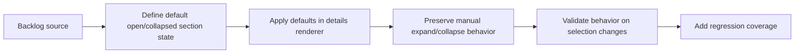

## task_028_default_collapsed_secondary_sections_in_detail_panel - Default secondary detail sections to collapsed in the plugin detail panel
> From version: 1.9.3
> Status: Done
> Understanding: 99%
> Confidence: 99%
> Progress: 100%
> Complexity: Low
> Theme: Detail panel scanability and progressive disclosure
> Reminder: Update status/understanding/confidence/progress and dependencies/references when you edit this doc.

# Context
- Derived from backlog item `item_033_default_collapsed_secondary_sections_in_detail_panel`.
- Source file: `logics/backlog/item_033_default_collapsed_secondary_sections_in_detail_panel.md`.
- Related request(s): `req_029_default_collapsed_secondary_sections_in_detail_panel`.

# Plan
- [x] 1. Clarify where default collapsed-section state is initialized today.
- [x] 2. Set `Indicators` open by default and `Companion docs`, `Specs`, `References`, `Used by` closed by default.
- [x] 3. Preserve existing manual expand/collapse behavior and section actions.
- [x] 4. Verify the intended defaults when switching selected items.
- [x] 5. Add/adjust harness tests for the default section-open hierarchy.
- [x] FINAL: Update related Logics docs

# AC Traceability
- AC1/AC2 -> Step 2. Proof: TODO.
- AC3/AC4/AC5/AC6 -> Step 2. Proof: TODO.
- AC7/AC8 -> Steps 3 and 4. Proof: TODO.
- AC9 -> Step 3. Proof: TODO.
- AC10 -> Step 5. Proof: TODO.

# Links
- Backlog item: `item_033_default_collapsed_secondary_sections_in_detail_panel`
- Request(s): `req_029_default_collapsed_secondary_sections_in_detail_panel`

# Validation
- `npm run compile`
- `npm test -- tests/webview.harness-a11y.test.ts`
- `npm test -- tests/webview.layout-collapse.test.ts`

# Definition of Done (DoD)
- [x] Scope implemented and acceptance criteria covered.
- [x] Validation commands executed and results captured.
- [x] Linked request/backlog/task docs updated.
- [x] Status is `Done` and progress is `100%`.
