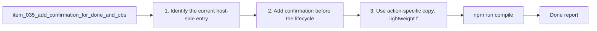

## task_029_add_confirmation_for_done_and_obsolete_actions - Add confirmation before Done and Obsolete lifecycle actions
> From version: 1.9.3 (refreshed)
> Status: Done
> Understanding: 100%
> Confidence: 100%
> Progress: 100%
> Complexity: Low
> Theme: Lifecycle safety and action confirmation
> Reminder: Update status/understanding/confidence/progress and dependencies/references when you edit this doc.

# Context
Derived from `logics/backlog/item_035_add_confirmation_for_done_and_obsolete_actions.md`.
- Derived from backlog item `item_035_add_confirmation_for_done_and_obsolete_actions`.
- Source file: `logics/backlog/item_035_add_confirmation_for_done_and_obsolete_actions.md`.
- Related request(s): `req_030_add_confirmation_for_done_and_obsolete_actions`.

# Plan
- [x] 1. Identify the current host-side entry points for `Done` and `Obsolete`.
- [x] 2. Add confirmation before the lifecycle write path for both actions.
- [x] 3. Use action-specific copy: lightweight for `Done`, more cautious for `Obsolete`.
- [x] 4. Preserve the current success message and refresh behavior after confirmed updates.
- [x] 5. Add/adjust tests for confirmed and cancelled paths.
- [x] FINAL: Update related Logics docs

# AC Traceability
- AC1/AC2 -> Step 2. Proof: covered by linked task completion.
- AC3 -> Step 5. Proof: covered by linked task completion.
- AC4/AC7 -> Step 4. Proof: covered by linked task completion.
- AC5/AC6 -> Step 3. Proof: covered by linked task completion.
- AC8 -> Step 5. Proof: covered by linked task completion.

# Links
- Backlog item: `item_035_add_confirmation_for_done_and_obsolete_actions`
- Request(s): `req_030_add_confirmation_for_done_and_obsolete_actions`

# Validation
- `npm run compile`
- `npm test`

# Definition of Done (DoD)
- [x] Scope implemented and acceptance criteria covered.
- [x] Validation commands executed and results captured.
- [x] Linked request/backlog/task docs updated.
- [x] Status is `Done` and progress is `100%`.

# Report
- 

# Notes
