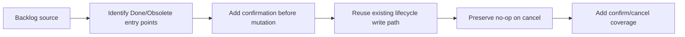

## task_029_add_confirmation_for_done_and_obsolete_actions - Add confirmation before Done and Obsolete lifecycle actions
> From version: 1.9.3
> Status: Proposed
> Understanding: 99%
> Confidence: 98%
> Progress: 0%
> Complexity: Low
> Theme: Lifecycle safety and action confirmation
> Reminder: Update status/understanding/confidence/progress and dependencies/references when you edit this doc.

# Context
- Derived from backlog item `item_035_add_confirmation_for_done_and_obsolete_actions`.
- Source file: `logics/backlog/item_035_add_confirmation_for_done_and_obsolete_actions.md`.
- Related request(s): `req_030_add_confirmation_for_done_and_obsolete_actions`.

# Plan
- [ ] 1. Identify the current host-side entry points for `Done` and `Obsolete`.
- [ ] 2. Add confirmation before the lifecycle write path for both actions.
- [ ] 3. Use action-specific copy, with more caution for `Obsolete`.
- [ ] 4. Preserve the current success message and refresh behavior after confirmed updates.
- [ ] 5. Add/adjust tests for confirmed and cancelled paths.
- [ ] FINAL: Update related Logics docs

# AC Traceability
- AC1/AC2 -> Step 2.
- AC3 -> Step 5.
- AC4/AC7 -> Step 4.
- AC5/AC6 -> Step 3.
- AC8 -> Step 5.

# Links
- Backlog item: `item_035_add_confirmation_for_done_and_obsolete_actions`
- Request(s): `req_030_add_confirmation_for_done_and_obsolete_actions`

# Validation
- `npm run compile`
- `npm test`

# Definition of Done (DoD)
- [ ] Scope implemented and acceptance criteria covered.
- [ ] Validation commands executed and results captured.
- [ ] Linked request/backlog/task docs updated.
- [ ] Status is `Done` and progress is `100%`.
