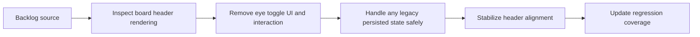

## task_030_remove_column_eye_toggle_from_board - Remove the eye toggle from board columns
> From version: 1.9.3
> Status: Proposed
> Understanding: 99%
> Confidence: 98%
> Progress: 0%
> Complexity: Low
> Theme: Board UI simplification and control hygiene
> Reminder: Update status/understanding/confidence/progress and dependencies/references when you edit this doc.

# Context
- Derived from backlog item `item_036_remove_column_eye_toggle_from_board`.
- Source file: `logics/backlog/item_036_remove_column_eye_toggle_from_board.md`.
- Related request(s): `req_031_remove_column_eye_toggle_from_board`.

# Plan
- [ ] 1. Identify where the eye toggle is rendered and where its interaction path is handled.
- [ ] 2. Remove the eye toggle from board column headers.
- [ ] 3. Remove or neutralize the corresponding per-column hide/show behavior.
- [ ] 4. Ensure header alignment and remaining actions stay stable after removal.
- [ ] 5. Handle any persisted collapsed-column state safely.
- [ ] 6. Add/adjust tests for the new board-header behavior.
- [ ] FINAL: Update related Logics docs

# AC Traceability
- AC1/AC2 -> Steps 2 and 3.
- AC3/AC4 -> Step 4.
- AC5 -> Step 4.
- AC6 -> Step 5.
- AC7 -> Step 6.

# Links
- Backlog item: `item_036_remove_column_eye_toggle_from_board`
- Request(s): `req_031_remove_column_eye_toggle_from_board`

# Validation
- `npm run compile`
- `npm test -- tests/webview.harness-a11y.test.ts`
- `npm test -- tests/webview.layout-collapse.test.ts`

# Definition of Done (DoD)
- [ ] Scope implemented and acceptance criteria covered.
- [ ] Validation commands executed and results captured.
- [ ] Linked request/backlog/task docs updated.
- [ ] Status is `Done` and progress is `100%`.
