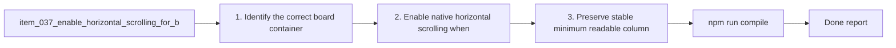

## task_031_enable_horizontal_scrolling_for_board_columns - Enable horizontal scrolling for board columns
> From version: 1.10.1 (refreshed)
> Status: Done
> Understanding: 100% (refreshed)
> Confidence: 100% (refreshed)
> Progress: 100%
> Complexity: Low
> Theme: Board navigation and overflow ergonomics
> Reminder: Update status/understanding/confidence/progress and dependencies/references when you edit this doc.

# Context
Derived from `logics/backlog/item_037_enable_horizontal_scrolling_for_board_columns.md`.
- Derived from backlog item `item_037_enable_horizontal_scrolling_for_board_columns`.
- Source file: `logics/backlog/item_037_enable_horizontal_scrolling_for_board_columns.md`.
- Related request(s): `req_032_enable_horizontal_scrolling_for_board_columns`.
- Related architecture decision(s): `adr_005_define_responsive_layout_scroll_and_sizing_rules_for_plugin_views`.

# Plan
- [x] 1. Identify the correct board container level for horizontal overflow handling.
- [x] 2. Enable native horizontal scrolling when total column width exceeds viewport width.
- [x] 3. Preserve stable minimum readable column widths under overflow.
- [x] 4. Verify toolbar and details panel stay outside the horizontal scroll path.
- [x] 5. Verify responsive behaviors such as stacked layout and forced list mode still work.
- [x] 6. Add/adjust regression tests for board overflow behavior.
- [x] FINAL: Update related Logics docs

# AC Traceability
- AC1/AC2 -> Steps 1 and 2. Proof: covered by linked task completion.
- AC3 -> Step 3. Proof: covered by linked task completion.
- AC4 -> Step 2 and step 6 validation scenarios. Proof: covered by linked task completion.
- AC5 -> Step 4. Proof: covered by linked task completion.
- AC6 -> Step 5. Proof: covered by linked task completion.
- AC7 -> Step 6. Proof: covered by linked task completion.

# Links
- Backlog item: `item_037_enable_horizontal_scrolling_for_board_columns`
- Request(s): `req_032_enable_horizontal_scrolling_for_board_columns`
- Architecture decision(s): `adr_005_define_responsive_layout_scroll_and_sizing_rules_for_plugin_views`

# Validation
- `npm run compile`
- `npm test -- tests/webview.harness-a11y.test.ts`
- `npm test -- tests/webview.layout-collapse.test.ts`

# Definition of Done (DoD)
- [x] Scope implemented and acceptance criteria covered.
- [x] Validation commands executed and results captured.
- [x] Linked request/backlog/task docs updated.
- [x] Status is `Done` and progress is `100%`.

# Report
- 

# Notes
