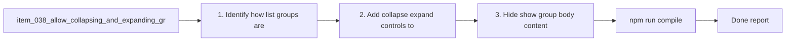

## task_032_allow_collapsing_and_expanding_groups_in_list_mode - Allow collapsing and expanding groups in list mode
> From version: 1.9.3 (refreshed)
> Status: Done
> Understanding: 100%
> Confidence: 100%
> Progress: 100%
> Complexity: Medium
> Theme: List-mode navigation and density control
> Reminder: Update status/understanding/confidence/progress and dependencies/references when you edit this doc.

# Context
Derived from `logics/backlog/item_038_allow_collapsing_and_expanding_groups_in_list_mode.md`.
- Derived from backlog item `item_038_allow_collapsing_and_expanding_groups_in_list_mode`.
- Source file: `logics/backlog/item_038_allow_collapsing_and_expanding_groups_in_list_mode.md`.
- Related request(s): `req_033_allow_collapsing_and_expanding_groups_in_list_mode`.

# Plan
- [x] 1. Identify how list groups are currently rendered and where header controls should live.
- [x] 2. Add collapse/expand controls to list-mode group headers while keeping groups expanded by default.
- [x] 3. Hide/show group body content while keeping headers visible.
- [x] 4. Ensure item selection and navigation still work after toggle cycles.
- [x] 5. Decide and implement safe persistence behavior for list-group collapse state.
- [x] 6. Add/adjust tests for list-group collapse/expand behavior.
- [x] FINAL: Update related Logics docs

# AC Traceability
- AC1/AC2/AC3 -> Steps 2 and 3. Proof: covered by linked task completion.
- AC4 -> Step 6 scenarios across visible optional groups. Proof: covered by linked task completion.
- AC5 -> Step 2 and step 3 layout behavior. Proof: covered by linked task completion.
- AC6 -> Step 4. Proof: covered by linked task completion.
- AC7 -> Step 5. Proof: covered by linked task completion.
- AC8 -> Step 6. Proof: covered by linked task completion.

# Links
- Backlog item: `item_038_allow_collapsing_and_expanding_groups_in_list_mode`
- Request(s): `req_033_allow_collapsing_and_expanding_groups_in_list_mode`

# Validation
- `npm run compile`
- `npm test -- tests/webview.harness-a11y.test.ts`
- `npm test -- tests/webview.layout-collapse.test.ts`

# Definition of Done (DoD)
- [x] Scope implemented and acceptance criteria covered.
- [x] Validation commands executed and results captured.
- [x] Linked request/backlog/task docs updated.
- [x] Status is `Done` and progress is `100%`.

# Report
- 

# Notes
