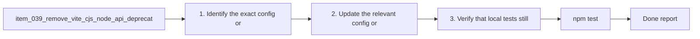

## task_033_remove_vite_cjs_node_api_deprecation_warning_from_test_runs - Remove the Vite CJS Node API deprecation warning from test runs
> From version: 1.9.3 (refreshed)
> Status: Done
> Understanding: 99%
> Confidence: 99%
> Progress: 100%
> Complexity: Low
> Theme: Tooling hygiene and test-run clarity
> Reminder: Update status/understanding/confidence/progress and dependencies/references when you edit this doc.

# Context
Derived from `logics/backlog/item_039_remove_vite_cjs_node_api_deprecation_warning_from_test_runs.md`.
- Derived from backlog item `item_039_remove_vite_cjs_node_api_deprecation_warning_from_test_runs`.
- Source file: `logics/backlog/item_039_remove_vite_cjs_node_api_deprecation_warning_from_test_runs.md`.
- Related request(s): `req_034_remove_vite_cjs_node_api_deprecation_warning_from_test_runs`.

# Plan
- [x] 1. Identify the exact config or module-format reason Vitest is using the deprecated Vite CJS Node API path.
- [x] 2. Update the relevant config or package/module setup to use the supported path.
- [x] 3. Verify that local tests still run correctly after the change.
- [x] 4. Verify that smoke-test or adjacent validation workflows still behave correctly.
- [x] 5. Confirm the warning is actually gone from test output.
- [x] FINAL: Update related Logics docs

# AC Traceability
- AC1/AC2 -> Steps 1 and 2. Proof: covered by linked task completion.
- AC3 -> Step 3. Proof: covered by linked task completion.
- AC4 -> Step 4. Proof: covered by linked task completion.
- AC5 -> Step 2. Proof: covered by linked task completion.
- AC6 -> Steps 3, 4, and 5. Proof: covered by linked task completion.

# Links
- Backlog item: `item_039_remove_vite_cjs_node_api_deprecation_warning_from_test_runs`
- Request(s): `req_034_remove_vite_cjs_node_api_deprecation_warning_from_test_runs`

# Validation
- `npm test`
- `npm run test:smoke`

# Definition of Done (DoD)
- [x] Scope implemented and acceptance criteria covered.
- [x] Validation commands executed and results captured.
- [x] Linked request/backlog/task docs updated.
- [x] Status is `Done` and progress is `100%`.

# Report
- 

# Notes
