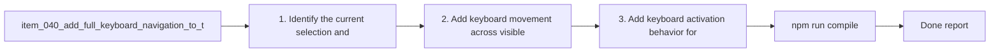

## task_034_add_full_keyboard_navigation_to_the_plugin - Add full keyboard navigation to the plugin
> From version: 1.9.3 (refreshed)
> Status: Done
> Understanding: 100%
> Confidence: 100%
> Progress: 100%
> Complexity: Medium
> Theme: Accessibility and operator productivity
> Reminder: Update status/understanding/confidence/progress and dependencies/references when you edit this doc.

# Context
Derived from `logics/backlog/item_040_add_full_keyboard_navigation_to_the_plugin.md`.
- Derived from backlog item `item_040_add_full_keyboard_navigation_to_the_plugin`.
- Source file: `logics/backlog/item_040_add_full_keyboard_navigation_to_the_plugin.md`.
- Related request(s): `req_035_add_full_keyboard_navigation_to_the_plugin`.

# Plan
- [x] 1. Identify the current selection and focus model across board, list, toolbar, and details.
- [x] 2. Add keyboard movement across visible items in board and list modes using the explicit board/list directional model.
- [x] 3. Add keyboard activation behavior for the selected item with `Enter`, `Shift+Enter`, and `Cmd/Ctrl+Enter` kept coherent.
- [x] 4. Ensure toolbar and detail actions remain keyboard-operable with visible focus.
- [x] 5. Validate behavior across responsive modes and existing mouse interactions.
- [x] 6. Add/adjust regression tests for the main keyboard flows.
- [x] FINAL: Update related Logics docs

# AC Traceability
- AC1/AC2 -> Steps 2 and 3. Proof: covered by linked task completion.
- AC3/AC4 -> Step 4. Proof: covered by linked task completion.
- AC5 -> Step 4 and step 6 assertions. Proof: covered by linked task completion.
- AC6 -> Step 5. Proof: covered by linked task completion.
- AC7 -> Step 5. Proof: covered by linked task completion.
- AC8 -> Step 6. Proof: covered by linked task completion.

# Links
- Backlog item: `item_040_add_full_keyboard_navigation_to_the_plugin`
- Request(s): `req_035_add_full_keyboard_navigation_to_the_plugin`

# Validation
- `npm run compile`
- `npm test`

# Definition of Done (DoD)
- [x] Scope implemented and acceptance criteria covered.
- [x] Validation commands executed and results captured.
- [x] Linked request/backlog/task docs updated.
- [x] Status is `Done` and progress is `100%`.

# Report
- 

# Notes
