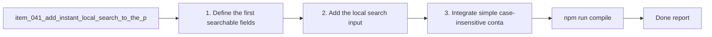

## task_035_add_instant_local_search_to_the_plugin - Add instant local search to the plugin
> From version: 1.9.3 (refreshed)
> Status: Done
> Understanding: 100%
> Confidence: 100%
> Progress: 100%
> Complexity: Medium
> Theme: Navigation speed and findability
> Reminder: Update status/understanding/confidence/progress and dependencies/references when you edit this doc.

# Context
Derived from `logics/backlog/item_041_add_instant_local_search_to_the_plugin.md`.
- Derived from backlog item `item_041_add_instant_local_search_to_the_plugin`.
- Source file: `logics/backlog/item_041_add_instant_local_search_to_the_plugin.md`.
- Related request(s): `req_036_add_instant_local_search_to_the_plugin`.

# Plan
- [x] 1. Define the first searchable fields and place one global search control in the UI.
- [x] 2. Add the local search input to the plugin UI.
- [x] 3. Integrate simple case-insensitive containment search with existing filter and rendering logic.
- [x] 4. Ensure search works coherently in board mode and list mode.
- [x] 5. Verify filters apply first, search narrows the visible subset, and clearing search restores the expected filtered view.
- [x] 6. Add/adjust regression tests for the main search flows.
- [x] FINAL: Update related Logics docs

# AC Traceability
- AC1/AC2 -> Steps 2 and 3. Proof: covered by linked task completion.
- AC3/AC4 -> Step 4. Proof: covered by linked task completion.
- AC5/AC6 -> Steps 3 and 5. Proof: covered by linked task completion.
- AC7 -> Step 4 and step 6 realistic coverage. Proof: covered by linked task completion.
- AC8 -> Step 6. Proof: covered by linked task completion.

# Links
- Backlog item: `item_041_add_instant_local_search_to_the_plugin`
- Request(s): `req_036_add_instant_local_search_to_the_plugin`

# Validation
- `npm run compile`
- `npm test`

# Definition of Done (DoD)
- [x] Scope implemented and acceptance criteria covered.
- [x] Validation commands executed and results captured.
- [x] Linked request/backlog/task docs updated.
- [x] Status is `Done` and progress is `100%`.

# Report
- 

# Notes
