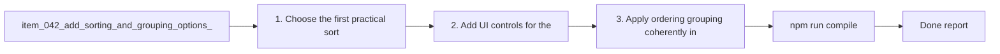

## task_036_add_sorting_and_grouping_options_to_the_plugin - Add sorting and grouping options to the plugin
> From version: 1.9.3 (refreshed)
> Status: Done
> Understanding: 99%
> Confidence: 99%
> Progress: 100%
> Complexity: Medium
> Theme: Information ordering and workspace navigation
> Reminder: Update status/understanding/confidence/progress and dependencies/references when you edit this doc.

# Context
Derived from `logics/backlog/item_042_add_sorting_and_grouping_options_to_the_plugin.md`.
- Derived from backlog item `item_042_add_sorting_and_grouping_options_to_the_plugin`.
- Source file: `logics/backlog/item_042_add_sorting_and_grouping_options_to_the_plugin.md`.
- Related request(s): `req_037_add_sorting_and_grouping_options_to_the_plugin`.

# Plan
- [x] 1. Choose the first practical sort and grouping options worth exposing, prioritizing `updatedAt`, progress/completion, and key workflow status indicators.
- [x] 2. Add UI controls for the selected ordering/grouping modes.
- [x] 3. Apply ordering/grouping coherently in the relevant rendering paths, with sorting staying inside the active grouping boundaries by default.
- [x] 4. Keep the active mode visible and understandable in the UI.
- [x] 5. Ensure composition with existing filters and default presentation.
- [x] 6. Add/adjust regression tests for the main ordering/grouping paths.
- [x] FINAL: Update related Logics docs

# AC Traceability
- AC1/AC2 -> Steps 1, 2, and 3. Proof: covered by linked task completion.
- AC3 -> Step 3. Proof: covered by linked task completion.
- AC4/AC6 -> Steps 4 and 5. Proof: covered by linked task completion.
- AC5 -> Step 4. Proof: covered by linked task completion.
- AC7 -> Step 6. Proof: covered by linked task completion.

# Links
- Backlog item: `item_042_add_sorting_and_grouping_options_to_the_plugin`
- Request(s): `req_037_add_sorting_and_grouping_options_to_the_plugin`

# Validation
- `npm run compile`
- `npm test`

# Definition of Done (DoD)
- [x] Scope implemented and acceptance criteria covered.
- [x] Validation commands executed and results captured.
- [x] Linked request/backlog/task docs updated.
- [x] Status is `Done` and progress is `100%`.

# Report
- 

# Notes
