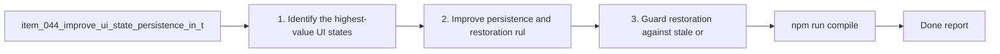

## task_038_improve_ui_state_persistence_in_the_plugin - Improve UI state persistence in the plugin
> From version: 1.9.3 (refreshed)
> Status: Done
> Understanding: 100%
> Confidence: 100%
> Progress: 100%
> Complexity: Medium
> Theme: UI continuity and workflow stability
> Reminder: Update status/understanding/confidence/progress and dependencies/references when you edit this doc.

# Context
Derived from `logics/backlog/item_044_improve_ui_state_persistence_in_the_plugin.md`.
- Derived from backlog item `item_044_improve_ui_state_persistence_in_the_plugin`.
- Source file: `logics/backlog/item_044_improve_ui_state_persistence_in_the_plugin.md`.
- Related request(s): `req_039_improve_ui_state_persistence_in_the_plugin`.

# Plan
- [x] 1. Identify the highest-value UI states worth persisting more reliably, scoped per workspace.
- [x] 2. Improve persistence and restoration rules for those states.
- [x] 3. Guard restoration against stale or misleading state when data changes, dropping invalid fragments quietly.
- [x] 4. Validate compatibility with current filters, responsive behavior, and temporary responsive overrides of stored preferences.
- [x] 5. Add/adjust tests for the most important restored-state paths.
- [x] FINAL: Update related Logics docs

# AC Traceability
- AC1/AC2 -> Steps 1 and 2. Proof: covered by linked task completion.
- AC3 -> Step 4. Proof: covered by linked task completion.
- AC4/AC5 -> Steps 2 and 4. Proof: covered by linked task completion.
- AC6 -> Step 3. Proof: covered by linked task completion.
- AC7 -> Step 5. Proof: covered by linked task completion.
- AC1A -> covered by linked delivery scope. Proof: covered by linked task completion.

# Links
- Backlog item: `item_044_improve_ui_state_persistence_in_the_plugin`
- Request(s): `req_039_improve_ui_state_persistence_in_the_plugin`

# Validation
- `npm run compile`
- `npm test`

# Definition of Done (DoD)
- [x] Scope implemented and acceptance criteria covered.
- [x] Validation commands executed and results captured.
- [x] Linked request/backlog/task docs updated.
- [x] Status is `Done` and progress is `100%`.

# Report
- 

# Notes
