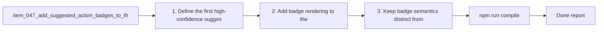

## task_041_add_suggested_action_badges_to_the_plugin - Add suggested-action badges to the plugin
> From version: 1.9.3 (refreshed)
> Status: Done
> Understanding: 99%
> Confidence: 99%
> Progress: 100%
> Complexity: Medium
> Theme: Workflow guidance and proactive orchestration
> Reminder: Update status/understanding/confidence/progress and dependencies/references when you edit this doc.

# Context
Derived from `logics/backlog/item_047_add_suggested_action_badges_to_the_plugin.md`.
- Derived from backlog item `item_047_add_suggested_action_badges_to_the_plugin`.
- Source file: `logics/backlog/item_047_add_suggested_action_badges_to_the_plugin.md`.
- Related request(s): `req_042_add_suggested_action_badges_to_the_plugin`.

# Plan
- [x] 1. Define the first high-confidence suggested-action badge heuristics as opportunistic guidance rather than hard workflow gates.
- [x] 2. Add badge rendering to the main browsing surfaces.
- [x] 3. Keep badge semantics distinct from current indicators and from health diagnostics.
- [x] 4. Verify coherence in board mode and list mode.
- [x] 5. Ensure existing interactions remain intact after badge introduction and card-level badge density stays controlled.
- [x] 6. Add/adjust regression tests for suggested-badge rendering.
- [x] FINAL: Update related Logics docs

# AC Traceability
- AC1/AC2 -> Steps 1 and 2. Proof: covered by linked task completion.
- AC3 -> Step 3. Proof: covered by linked task completion.
- AC4 -> Step 4. Proof: covered by linked task completion.
- AC5 -> Step 5. Proof: covered by linked task completion.
- AC6 -> Step 6. Proof: covered by linked task completion.

# Links
- Backlog item: `item_047_add_suggested_action_badges_to_the_plugin`
- Request(s): `req_042_add_suggested_action_badges_to_the_plugin`

# Validation
- `npm run compile`
- `npm test`

# Definition of Done (DoD)
- [x] Scope implemented and acceptance criteria covered.
- [x] Validation commands executed and results captured.
- [x] Linked request/backlog/task docs updated.
- [x] Status is `Done` and progress is `100%`.

# Report
- 

# Notes
