## task_042_improve_plugin_onboarding_and_empty_states - Improve plugin onboarding and empty states
> From version: 1.9.3 (refreshed)
> Status: Done
> Understanding: 99%
> Confidence: 99%
> Progress: 100%
> Complexity: Medium
> Theme: Discoverability and first-use clarity
> Reminder: Update status/understanding/confidence/progress and dependencies/references when you edit this doc.

```mermaid
%% logics-kind: task
%% logics-signature: task|improve-plugin-onboarding-and-empty-stat|item-048-improve-plugin-onboarding-and-e|1-identify-the-highest-friction-empty-st|npm-run-compile
flowchart LR
    Backlog[item_048_improve_plugin_onboarding_and_emp] --> Step1[1. Identify the highest-friction empty sta]
    Step1 --> Step2[2. Improve empty-state copy and actionabil]
    Step2 --> Step3[3. Add lightweight contextual onboarding h]
    Step3 --> Validation[npm run compile]
    Validation --> Report[Done report]
```

# Context
Derived from `logics/backlog/item_048_improve_plugin_onboarding_and_empty_states.md`.
- Derived from backlog item `item_048_improve_plugin_onboarding_and_empty_states`.
- Source file: `logics/backlog/item_048_improve_plugin_onboarding_and_empty_states.md`.
- Related request(s): `req_043_improve_plugin_onboarding_and_empty_states`.

# Plan
- [x] 1. Identify the highest-friction empty states and first-use confusion points.
- [x] 2. Improve empty-state copy and actionability, prioritizing contextual workspace guidance.
- [x] 3. Add lightweight contextual onboarding/help affordances where they provide real value.
- [x] 4. Keep the resulting guidance non-intrusive and dismissible where appropriate for experienced users.
- [x] 5. Add/adjust regression tests for the main onboarding or empty-state surfaces.
- [x] FINAL: Update related Logics docs

# AC Traceability
- AC1/AC2 -> Steps 2 and 3. Proof: covered by linked task completion.
- AC3/AC4 -> Step 4. Proof: covered by linked task completion.
- AC5 -> Step 4. Proof: covered by linked task completion.
- AC6 -> Step 5. Proof: covered by linked task completion.

# Links
- Backlog item: `item_048_improve_plugin_onboarding_and_empty_states`
- Request(s): `req_043_improve_plugin_onboarding_and_empty_states`

# Validation
- `npm run compile`
- `npm test`

# Definition of Done (DoD)
- [x] Scope implemented and acceptance criteria covered.
- [x] Validation commands executed and results captured.
- [x] Linked request/backlog/task docs updated.
- [x] Status is `Done` and progress is `100%`.

# Report
- 

# Notes
