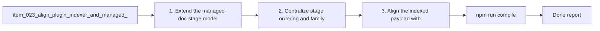

## task_045_align_plugin_indexer_and_managed_doc_model_for_companion_docs - Align plugin indexer and managed doc model for companion docs
> From version: 1.9.0 (refreshed)
> Status: Done
> Understanding: 100%
> Confidence: 99%
> Progress: 100%
> Complexity: Medium
> Theme: Plugin managed-doc model and indexing
> Reminder: Update status/understanding/confidence/progress and dependencies/references when you edit this doc.

# Context
Derived from `logics/backlog/item_023_align_plugin_indexer_and_managed_doc_model_for_companion_docs.md`.
- Derived from backlog item `item_023_align_plugin_indexer_and_managed_doc_model_for_companion_docs`.
- Source file: `logics/backlog/item_023_align_plugin_indexer_and_managed_doc_model_for_companion_docs.md`.
- Related request(s): `req_022_align_vs_code_plugin_with_companion_docs_workflow`.

# Plan
- [x] 1. Extend the managed-doc stage model to cover companion docs.
- [x] 2. Centralize stage ordering and family helpers used by the plugin indexer.
- [x] 3. Align the indexed payload with the expanded managed-doc model.
- [x] 4. Add targeted regression coverage for the updated indexing/model behavior.
- [x] FINAL: Update related Logics docs

# Links
- Backlog item: `item_023_align_plugin_indexer_and_managed_doc_model_for_companion_docs`
- Request(s): `req_022_align_vs_code_plugin_with_companion_docs_workflow`

# Validation
- `npm run compile`
- `npm test`

# Definition of Done (DoD)
- [x] Scope implemented and acceptance criteria covered.
- [x] Validation commands executed and results captured.
- [x] Linked request/backlog/task docs updated.
- [x] Status is `Done` and progress is `100%`.

# Report
- 

# Notes
