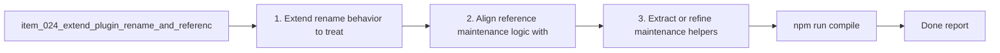

## task_046_extend_plugin_rename_and_reference_maintenance_to_companion_docs - Extend plugin rename and reference maintenance to companion docs
> From version: 1.9.0 (refreshed)
> Status: Done
> Understanding: 100%
> Confidence: 98%
> Progress: 100%
> Complexity: Medium
> Theme: Plugin maintenance and reference coherence
> Reminder: Update status/understanding/confidence/progress and dependencies/references when you edit this doc.

# Context
Derived from `logics/backlog/item_024_extend_plugin_rename_and_reference_maintenance_to_companion_docs.md`.
- Derived from backlog item `item_024_extend_plugin_rename_and_reference_maintenance_to_companion_docs`.
- Source file: `logics/backlog/item_024_extend_plugin_rename_and_reference_maintenance_to_companion_docs.md`.
- Related request(s): `req_022_align_vs_code_plugin_with_companion_docs_workflow`.

# Plan
- [x] 1. Extend rename behavior to treat companion docs as first-class managed docs.
- [x] 2. Align reference maintenance logic with the expanded document family.
- [x] 3. Extract or refine maintenance helpers where that improves host-side clarity.
- [x] 4. Add regression coverage for companion-doc rename/reference maintenance.
- [x] FINAL: Update related Logics docs

# Links
- Backlog item: `item_024_extend_plugin_rename_and_reference_maintenance_to_companion_docs`
- Request(s): `req_022_align_vs_code_plugin_with_companion_docs_workflow`

# Validation
- `npm run compile`
- `npm test`

# Definition of Done (DoD)
- [x] Scope implemented and acceptance criteria covered.
- [x] Validation commands executed and results captured.
- [x] Linked request/backlog/task docs updated.
- [x] Status is `Done` and progress is `100%`.

# Report
- 

# Notes
