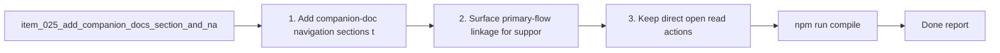

## task_047_add_companion_docs_section_and_navigation_in_plugin_details_panel - Add companion docs section and navigation in plugin details panel
> From version: 1.9.0 (refreshed)
> Status: Done
> Understanding: 100%
> Confidence: 98%
> Progress: 100%
> Complexity: Medium
> Theme: Plugin details-panel UX and navigation
> Reminder: Update status/understanding/confidence/progress and dependencies/references when you edit this doc.

# Context
Derived from `logics/backlog/item_025_add_companion_docs_section_and_navigation_in_plugin_details_panel.md`.
- Derived from backlog item `item_025_add_companion_docs_section_and_navigation_in_plugin_details_panel`.
- Source file: `logics/backlog/item_025_add_companion_docs_section_and_navigation_in_plugin_details_panel.md`.
- Related request(s): `req_022_align_vs_code_plugin_with_companion_docs_workflow`.

# Plan
- [x] 1. Add companion-doc navigation sections to the details panel.
- [x] 2. Surface primary-flow linkage for supporting docs and contextual specs where needed.
- [x] 3. Keep direct open/read actions coherent for managed links.
- [x] 4. Verify the details-panel UX remains readable after the new sections land.
- [x] FINAL: Update related Logics docs

# Links
- Backlog item: `item_025_add_companion_docs_section_and_navigation_in_plugin_details_panel`
- Request(s): `req_022_align_vs_code_plugin_with_companion_docs_workflow`

# Validation
- `npm run compile`
- `npm test`

# Definition of Done (DoD)
- [x] Scope implemented and acceptance criteria covered.
- [x] Validation commands executed and results captured.
- [x] Linked request/backlog/task docs updated.
- [x] Status is `Done` and progress is `100%`.

# Report
- 

# Notes
