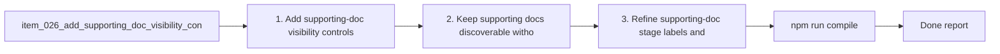

## task_048_add_supporting_doc_visibility_controls_to_plugin_board_and_list_views - Add supporting doc visibility controls to plugin board and list views
> From version: 1.9.0 (refreshed)
> Status: Done
> Understanding: 99%
> Confidence: 97%
> Progress: 100%
> Complexity: Medium
> Theme: Board/list visibility control model
> Reminder: Update status/understanding/confidence/progress and dependencies/references when you edit this doc.

# Context
Derived from `logics/backlog/item_026_add_supporting_doc_visibility_controls_to_plugin_board_and_list_views.md`.
- Derived from backlog item `item_026_add_supporting_doc_visibility_controls_to_plugin_board_and_list_views`.
- Source file: `logics/backlog/item_026_add_supporting_doc_visibility_controls_to_plugin_board_and_list_views.md`.
- Related request(s): `req_022_align_vs_code_plugin_with_companion_docs_workflow`.

# Plan
- [x] 1. Add supporting-doc visibility controls to board and list surfaces.
- [x] 2. Keep supporting docs discoverable without taking over the delivery-first default view.
- [x] 3. Refine supporting-doc stage labels and non-authoring behavior.
- [x] 4. Add regression coverage for the visibility model.
- [x] FINAL: Update related Logics docs

# Links
- Backlog item: `item_026_add_supporting_doc_visibility_controls_to_plugin_board_and_list_views`
- Request(s): `req_022_align_vs_code_plugin_with_companion_docs_workflow`

# Validation
- `npm run compile`
- `npm test`

# Definition of Done (DoD)
- [x] Scope implemented and acceptance criteria covered.
- [x] Validation commands executed and results captured.
- [x] Linked request/backlog/task docs updated.
- [x] Status is `Done` and progress is `100%`.

# Report
- 

# Notes
