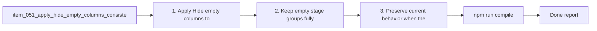

## task_056_apply_hide_empty_columns_consistently_in_list_mode - Apply hide empty columns consistently in list mode
> From version: 1.10.0 (refreshed)
> Status: Done
> Understanding: 99%
> Confidence: 100%
> Progress: 100%
> Complexity: Low
> Theme: Filter consistency across board and list views
> Reminder: Update status/understanding/confidence/progress and dependencies/references when you edit this doc.

# Context
Derived from `logics/backlog/item_051_apply_hide_empty_columns_consistently_in_list_mode.md`.
- Derived from backlog item `item_051_apply_hide_empty_columns_consistently_in_list_mode`.
- Source file: `logics/backlog/item_051_apply_hide_empty_columns_consistently_in_list_mode.md`.
- Related request(s): `req_046_apply_hide_empty_columns_consistently_in_list_mode`.

# Plan
- [x] 1. Apply `Hide empty columns` to stage-grouped list mode.
- [x] 2. Keep empty stage groups fully removed when the filter is enabled.
- [x] 3. Preserve current behavior when the filter is disabled and leave status grouping unchanged.
- [x] 4. Add regression coverage for the list-mode behavior.
- [x] FINAL: Update related Logics docs

# AC Traceability
- AC1/AC2/AC3 -> Steps 1, 2, and 3. Proof: covered by linked task completion.
- AC4 -> Step 4. Proof: covered by linked task completion.
- AC5 -> covered by linked delivery scope. Proof: covered by linked task completion.

# Links
- Backlog item: `item_051_apply_hide_empty_columns_consistently_in_list_mode`
- Request(s): `req_046_apply_hide_empty_columns_consistently_in_list_mode`

# Validation
- `npm run compile`
- `npm test -- tests/webview.harness-a11y.test.ts`

# Definition of Done (DoD)
- [x] Scope implemented and acceptance criteria covered.
- [x] Validation commands executed and results captured.
- [x] Linked request/backlog/task docs updated.
- [x] Status and progress updated.

# Report
- 

# Notes
