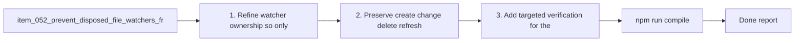

## task_057_prevent_disposed_file_watchers_from_accumulating_in_extension_subscriptions - Prevent disposed file watchers from accumulating in extension subscriptions
> From version: 1.10.0 (refreshed)
> Status: Done
> Understanding: 97%
> Confidence: 96%
> Progress: 100%
> Complexity: Low
> Theme: Extension runtime lifecycle hygiene
> Reminder: Update status/understanding/confidence/progress and dependencies/references when you edit this doc.

# Context
Derived from `logics/backlog/item_052_prevent_disposed_file_watchers_from_accumulating_in_extension_subscriptions.md`.
- Derived from backlog item `item_052_prevent_disposed_file_watchers_from_accumulating_in_extension_subscriptions`.
- Source file: `logics/backlog/item_052_prevent_disposed_file_watchers_from_accumulating_in_extension_subscriptions.md`.
- Related request(s): `req_047_prevent_disposed_file_watchers_from_accumulating_in_extension_subscriptions`.

# Plan
- [x] 1. Refine watcher ownership so only the live watcher remains retained.
- [x] 2. Preserve create/change/delete refresh behavior.
- [x] 3. Add targeted verification for the dispose-and-recreate lifecycle where practical.
- [x] 4. Keep the cleanup minimal and avoid unnecessary abstraction.
- [x] FINAL: Update related Logics docs

# AC Traceability
- AC1/AC2/AC3 -> Steps 1 and 4. Proof: covered by linked task completion.
- AC4 -> Steps 2 and 3. Proof: covered by linked task completion.

# Links
- Backlog item: `item_052_prevent_disposed_file_watchers_from_accumulating_in_extension_subscriptions`
- Request(s): `req_047_prevent_disposed_file_watchers_from_accumulating_in_extension_subscriptions`

# Validation
- `npm run compile`
- `npm test`

# Definition of Done (DoD)
- [x] Scope implemented and acceptance criteria covered.
- [x] Validation commands executed and results captured.
- [x] Linked request/backlog/task docs updated.
- [x] Status and progress updated.

# Report
- 

# Notes
