## task_058_strengthen_webview_regression_tests_for_list_filters_and_layout_css - Strengthen webview regression tests for list filters and layout CSS
> From version: 1.10.1 (refreshed)
> Status: Done
> Understanding: 100%
> Confidence: 99%
> Progress: 100%
> Complexity: Medium
> Theme: UI regression coverage and test trustworthiness
> Reminder: Update status/understanding/confidence/progress and dependencies/references when you edit this doc.

```mermaid
%% logics-kind: task
%% logics-signature: task|strengthen-webview-regression-tests-for-|item-053-strengthen-webview-regression-t|1-add-regression-coverage-for-hide|npm-test-tests-webview-harness-a11y-tes
flowchart LR
    Backlog[item_053_strengthen_webview_regression_tes] --> Step1[1. Add regression coverage for Hide]
    Step1 --> Step2[2. Strengthen layout CSS assertions where]
    Step2 --> Step3[3. Prefer behavior- and DOM-level assertio]
    Step3 --> Validation[npm test -- tests webview.harness-a11y.tes]
    Validation --> Report[Done report]
```

# Context
Derived from `logics/backlog/item_053_strengthen_webview_regression_tests_for_list_filters_and_layout_css.md`.
- Derived from backlog item `item_053_strengthen_webview_regression_tests_for_list_filters_and_layout_css`.
- Source file: `logics/backlog/item_053_strengthen_webview_regression_tests_for_list_filters_and_layout_css.md`.
- Related request(s): `req_048_strengthen_webview_regression_tests_for_list_filters_and_layout_css`.
- Related architecture decision(s): `adr_005_define_responsive_layout_scroll_and_sizing_rules_for_plugin_views`.

# Plan
- [x] 1. Add regression coverage for `Hide empty columns` in list mode.
- [x] 2. Strengthen layout/CSS assertions where current checks are too broad.
- [x] 3. Prefer behavior- and DOM-level assertions first, with targeted CSS checks only where needed.
- [x] 4. Keep the resulting suite maintainable and not overly brittle.
- [x] FINAL: Update related Logics docs

# AC Traceability
- AC1 -> Step 1. Proof: covered by linked task completion.
- AC2 -> Step 2. Proof: covered by linked task completion.
- AC3 -> Steps 3 and 4. Proof: covered by linked task completion.
- AC4 -> Step 2. Proof: covered by linked task completion.

# Links
- Backlog item: `item_053_strengthen_webview_regression_tests_for_list_filters_and_layout_css`
- Request(s): `req_048_strengthen_webview_regression_tests_for_list_filters_and_layout_css`
- Architecture decision(s): `adr_005_define_responsive_layout_scroll_and_sizing_rules_for_plugin_views`

# Validation
- `npm test -- tests/webview.harness-a11y.test.ts`
- `npm test -- tests/webview.layout-collapse.test.ts`

# Definition of Done (DoD)
- [x] Scope implemented and acceptance criteria covered.
- [x] Validation commands executed and results captured.
- [x] Linked request/backlog/task docs updated.
- [x] Status and progress updated.

# Report
- 

# Notes
