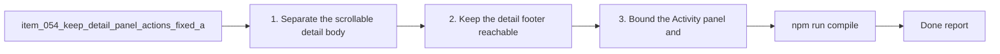

## task_059_keep_detail_panel_actions_fixed_at_the_bottom_while_content_scrolls - Keep detail panel actions fixed at the bottom while content scrolls
> From version: 1.10.1 (refreshed)
> Status: Done
> Understanding: 100% (refreshed)
> Confidence: 100% (refreshed)
> Progress: 100%
> Complexity: Medium
> Theme: Detail panel scrolling and action anchoring
> Reminder: Update status/understanding/confidence/progress and dependencies/references when you edit this doc.

# Context
Derived from `logics/backlog/item_054_keep_detail_panel_actions_fixed_at_the_bottom_while_content_scrolls.md`.
- Derived from backlog item `item_054_keep_detail_panel_actions_fixed_at_the_bottom_while_content_scrolls`.
- Source file: `logics/backlog/item_054_keep_detail_panel_actions_fixed_at_the_bottom_while_content_scrolls.md`.
- Related request(s): `req_049_keep_detail_panel_actions_fixed_at_the_bottom_while_content_scrolls`.
- Related architecture decision(s): `adr_005_define_responsive_layout_scroll_and_sizing_rules_for_plugin_views`.

# Plan
- [x] 1. Separate the scrollable detail body from a fixed bottom action footer.
- [x] 2. Keep the detail footer reachable in stacked and horizontal layouts.
- [x] 3. Bound the `Activity` panel and upper region so they do not starve `Details` of usable height.
- [x] 4. Add regression coverage for vertical budget and scroll-ownership behavior.
- [x] FINAL: Update related Logics docs

# Links
- Backlog item: `item_054_keep_detail_panel_actions_fixed_at_the_bottom_while_content_scrolls`
- Request(s): `req_049_keep_detail_panel_actions_fixed_at_the_bottom_while_content_scrolls`
- Architecture decision(s): `adr_005_define_responsive_layout_scroll_and_sizing_rules_for_plugin_views`

# Validation
- `npm run compile`
- `npm test -- tests/webview.layout-collapse.test.ts`
- `npm test -- tests/webview.harness-a11y.test.ts`

# Definition of Done (DoD)
- [x] Scope implemented and acceptance criteria covered.
- [x] Validation commands executed and results captured.
- [x] Linked request/backlog/task docs updated.
- [x] Status and progress updated.

# AC Traceability
- AC1 -> covered by linked delivery scope. Proof: covered by linked task completion.
- AC10 -> covered by linked delivery scope. Proof: covered by linked task completion.
- AC11 -> covered by linked delivery scope. Proof: covered by linked task completion.
- AC12 -> covered by linked delivery scope. Proof: covered by linked task completion.
- AC2 -> covered by linked delivery scope. Proof: covered by linked task completion.
- AC3 -> covered by linked delivery scope. Proof: covered by linked task completion.
- AC4 -> covered by linked delivery scope. Proof: covered by linked task completion.
- AC5 -> covered by linked delivery scope. Proof: covered by linked task completion.
- AC6 -> covered by linked delivery scope. Proof: covered by linked task completion.
- AC7 -> covered by linked delivery scope. Proof: covered by linked task completion.
- AC8 -> covered by linked delivery scope. Proof: covered by linked task completion.
- AC9 -> covered by linked delivery scope. Proof: covered by linked task completion.

# Report
- 

# Notes
