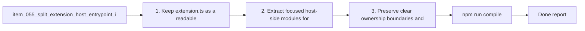

## task_060_split_extension_host_entrypoint_into_focused_modules - Split extension host entrypoint into focused modules
> From version: 1.10.0 (refreshed)
> Status: Done
> Understanding: 100%
> Confidence: 99%
> Progress: 100%
> Complexity: High
> Theme: Extension host modularity and ownership boundaries
> Reminder: Update status/understanding/confidence/progress and dependencies/references when you edit this doc.

# Context
Derived from `logics/backlog/item_055_split_extension_host_entrypoint_into_focused_modules.md`.
- Derived from backlog item `item_055_split_extension_host_entrypoint_into_focused_modules`.
- Source file: `logics/backlog/item_055_split_extension_host_entrypoint_into_focused_modules.md`.
- Related request(s): `req_050_split_oversized_source_files_into_coherent_modules`.
- Architectural direction in `adr_004_scale_the_plugin_around_a_derived_model_and_explicit_ui_state`.

# Plan
- [x] 1. Keep `extension.ts` as a readable bootstrap entrypoint.
- [x] 2. Extract focused host-side modules for commands, watcher/workspace lifecycle, preview helpers, and mutation helpers where appropriate.
- [x] 3. Preserve clear ownership boundaries and avoid circular dependencies.
- [x] 4. Verify behavior and test coverage remain unchanged after the refactor.
- [x] FINAL: Update related Logics docs

# Links
- Backlog item: `item_055_split_extension_host_entrypoint_into_focused_modules`
- Request(s): `req_050_split_oversized_source_files_into_coherent_modules`
- Architecture decision(s): `adr_004_scale_the_plugin_around_a_derived_model_and_explicit_ui_state`

# Validation
- `npm run compile`
- `npm test`

# Definition of Done (DoD)
- [x] Scope implemented and acceptance criteria covered.
- [x] Validation commands executed and results captured.
- [x] Linked request/backlog/task docs updated.
- [x] Status and progress updated.

# AC Traceability
- AC1 -> covered by linked delivery scope. Proof: covered by linked task completion.
- AC2 -> covered by linked delivery scope. Proof: covered by linked task completion.
- AC3 -> covered by linked delivery scope. Proof: covered by linked task completion.
- AC4 -> covered by linked delivery scope. Proof: covered by linked task completion.
- AC5 -> covered by linked delivery scope. Proof: covered by linked task completion.
- AC6 -> covered by linked delivery scope. Proof: covered by linked task completion.

# Report
- 

# Notes
