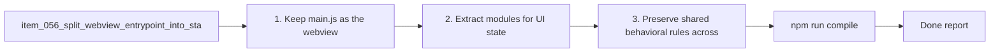

## task_061_split_webview_entrypoint_into_state_selector_and_orchestration_modules - Split webview entrypoint into state, selector, and orchestration modules
> From version: 1.10.0 (refreshed)
> Status: Done
> Understanding: 100%
> Confidence: 99%
> Progress: 100%
> Complexity: High
> Theme: Webview modularity and UI-state architecture
> Reminder: Update status/understanding/confidence/progress and dependencies/references when you edit this doc.

# Context
Derived from `logics/backlog/item_056_split_webview_entrypoint_into_state_selector_and_orchestration_modules.md`.
- Derived from backlog item `item_056_split_webview_entrypoint_into_state_selector_and_orchestration_modules`.
- Source file: `logics/backlog/item_056_split_webview_entrypoint_into_state_selector_and_orchestration_modules.md`.
- Related request(s): `req_050_split_oversized_source_files_into_coherent_modules`.
- Architectural direction in `adr_004_scale_the_plugin_around_a_derived_model_and_explicit_ui_state`.

# Plan
- [x] 1. Keep `main.js` as the webview bootstrap/composition shell.
- [x] 2. Extract modules for UI state, persistence, selectors, and high-level orchestration.
- [x] 3. Preserve shared behavioral rules across board, list, details, and auxiliary panels.
- [x] 4. Keep the split aligned with `adr_004` and avoid circular or overly fragmented dependencies.
- [x] FINAL: Update related Logics docs

# Links
- Backlog item: `item_056_split_webview_entrypoint_into_state_selector_and_orchestration_modules`
- Request(s): `req_050_split_oversized_source_files_into_coherent_modules`
- Architecture decision(s): `adr_004_scale_the_plugin_around_a_derived_model_and_explicit_ui_state`

# Validation
- `npm run compile`
- `npm test`

# Definition of Done (DoD)
- [x] Scope implemented and acceptance criteria covered.
- [x] Validation commands executed and results captured.
- [x] Linked request/backlog/task docs updated.
- [x] Status and progress updated.

# Report
- 

# Notes
