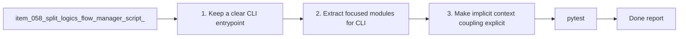

## task_063_split_logics_flow_manager_script_into_cli_and_workflow_modules - Split logics flow manager script into CLI and workflow modules
> From version: 1.10.0 (refreshed)
> Status: Done
> Understanding: 98%
> Confidence: 96%
> Progress: 100%
> Complexity: Medium
> Theme: Skill script modularity and workflow orchestration clarity
> Reminder: Update status/understanding/confidence/progress and dependencies/references when you edit this doc.

# Context
Derived from `logics/backlog/item_058_split_logics_flow_manager_script_into_cli_and_workflow_modules.md`.
- Derived from backlog item `item_058_split_logics_flow_manager_script_into_cli_and_workflow_modules`.
- Source file: `logics/backlog/item_058_split_logics_flow_manager_script_into_cli_and_workflow_modules.md`.
- Related request(s): `req_050_split_oversized_source_files_into_coherent_modules`.

# Plan
- [x] 1. Keep a clear CLI entrypoint for the flow-manager skill.
- [x] 2. Extract focused modules for CLI/config, workflow orchestration, file operations, and reporting as appropriate.
- [x] 3. Make implicit context coupling explicit where it blocks a clean split.
- [x] 4. Preserve current user-facing behavior and outputs.
- [x] FINAL: Update related Logics docs

# Links
- Backlog item: `item_058_split_logics_flow_manager_script_into_cli_and_workflow_modules`
- Request(s): `req_050_split_oversized_source_files_into_coherent_modules`

# Validation
- `pytest`

# Definition of Done (DoD)
- [x] Scope implemented and acceptance criteria covered.
- [x] Validation commands executed and results captured.
- [x] Linked request/backlog/task docs updated.
- [x] Status and progress updated.

# Report
- 

# Notes
